<!--
Editable source for docs/report/TECHNICAL_REPORT.docx.
Build with: .venv\Scripts\python.exe docs\report\build_report.py

TITLE PAGE
INTELLIGENT SYSTEM DEVELOPMENT
ASSIGNMENT 01
From Data Representation to Intelligent Applications

Systems:
1. Diabetes Classification System
2. Vietnam House Price Prediction System

Student: Nguyễn Thành Trung
Student ID: B23DCCN861
Class: D23CTPM01-B
Lecturer: _________________________________
Date: August 2026

The DOCX builder inserts an editable Word TOC field after the title page.
-->

<!-- REPORT BODY -->

# 1. Introduction

Assignment 01 develops two end-to-end intelligent systems from real datasets: a binary Diabetes Classification System and a Vietnam House Price Prediction System. The work follows a common engineering progression: **Real-world Problem → Data → Representation → Traditional Machine Learning → Controlled Experiments → Final Model → Intelligent Application**. The first system maps six patient measurements to an educational class prediction. The second maps eleven property attributes to an estimated listed price in billion VND.

The assignment objective is broader than obtaining a high metric. It examines how raw observations are represented, how invalid or missing fields are handled, how several traditional model families respond to the same representation, and how controlled experiments support a defensible final choice. A held-out test set is reserved for evaluation, while cross-validation on training data is used for configuration selection. The selected preprocessing and estimator are then saved together as a scikit-learn `Pipeline`, preventing the web, mobile, or API layers from inventing a second preprocessing procedure.

The application layer consists of a FastAPI backend, a React/Vite web client, an Expo React Native mobile client, and a Neo4j knowledge graph for the Diabetes model. The deployed topology uses Render for the API, Vercel for the web client, Neo4j AuraDB for the graph, and Expo Go for mobile demonstration. These are educational prediction systems: the Diabetes output is **not a medical diagnosis**, and the house-price output is not a professional valuation.

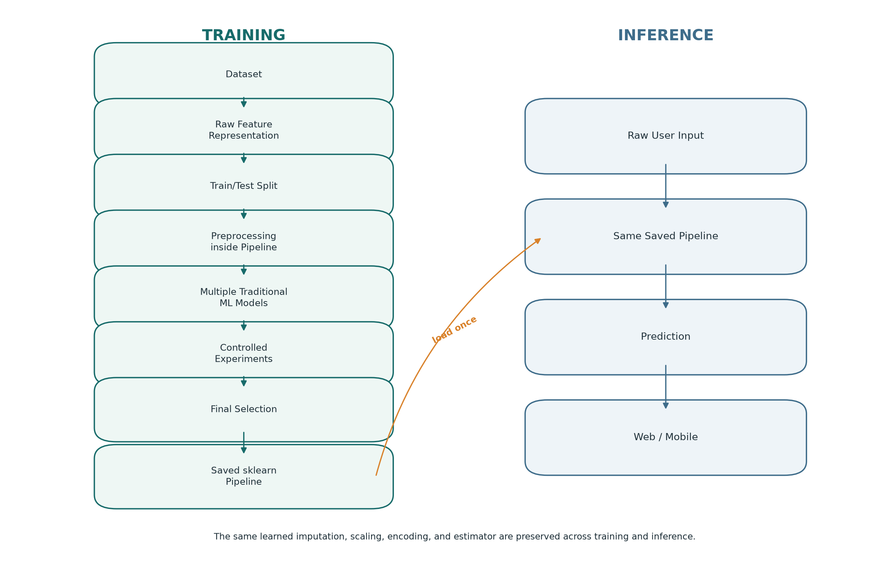

# 2. Intelligent System Definition

An intelligent system in this assignment combines a learned model with the data representation, preprocessing, evaluation process, inference contract, and user-facing software required to apply the model consistently. It is therefore more than a call to `model.fit()`. The learned estimator is valuable only when its input meaning is explicit and the same fitted transformations are used at inference time.

**Table 1. Assignment system overview.**

| System | Learning task | Raw application input | Output | Final estimator |
|---|---|---|---|---|
| Diabetes Classification | Binary classification | Six numerical patient attributes | Class 0 or 1, label, and class-1 probability | Random Forest Classifier |
| Vietnam House Price | Regression | Eleven numerical/categorical property attributes | Listed-price estimate in billion VND | Random Forest Regressor |

## 2.1 Diabetes Classification System

The Diabetes system receives `Pregnancies`, `Glucose`, `BloodPressure`, `BMI`, `DiabetesPedigreeFunction`, and `Age`. It produces an educational prediction for `Outcome`, where 0 is labelled Non-diabetic and 1 is labelled Diabetic. The class and probability describe the fitted assignment model; they have not been clinically validated and must not be treated as diagnosis, screening guidance, or a medical decision.

## 2.2 Vietnam House Price Prediction System

The House Price system receives a structured description of a listing: `Province`, `Area`, `Frontage`, `Access Road`, `House direction`, `Balcony direction`, `Floors`, `Bedrooms`, `Bathrooms`, `Legal status`, and `Furniture state`. It estimates the original `Price` target in billion VND. The prediction represents a learned association with 2024 listing prices, not a transaction guarantee or certified appraisal.

# 3. Problem Formulation

## 3.1 Classification Problem

For patient observation *i*, the selected raw vector is xᵢ ∈ ℝ⁶ and the target is yᵢ ∈ {0,1}. The classifier learns a function ŷ = fθ(x) from historical labelled observations. Evaluation focuses on the positive class and reports Accuracy, Precision, Recall, F1-score, and a confusion matrix. Accuracy measures the overall correct fraction, Precision measures the purity of positive predictions, Recall measures the fraction of actual positives recovered, and F1 is the harmonic mean of Precision and Recall.

The classification classes are imbalanced: 500 observations (65.1%) have Outcome 0 and 268 (34.9%) have Outcome 1. This motivates reporting metrics beyond Accuracy. A majority-class rule can appear acceptable by Accuracy while failing to detect every positive case.

## 3.2 Regression Problem

For property observation *i*, xᵢ contains a mixture of numerical and categorical raw attributes and yᵢ ∈ ℝ is `Price` in billion VND. The regressor learns ŷ = fθ(x). Evaluation uses MAE, MSE, RMSE, R², and MAPE. Lower MAE, MSE, RMSE, and MAPE are better; higher R² is better. RMSE and MAE remain in interpretable price units except that MSE is expressed in squared billion-VND units.

Regression does not use classification Accuracy. R² measures the fraction of target variance explained relative to a mean predictor under the evaluated sample; it is neither a correctness rate nor a percentage of predictions that are accurate.

# 4. Dataset

## 4.1 Diabetes Dataset

The notebook loads `data/diabetes/diabetes.csv`, a Kaggle diabetes dataset with 768 observations and nine columns: eight candidate inputs plus the `Outcome` target. Pandas reports no explicit `NaN` values and no duplicate rows. However, the absence of `NaN` does not imply complete measurements because several physiological columns contain zero values that are implausible as recorded measurements.

The target contains 500 class-0 and 268 class-1 observations. Glucose shows the strongest absolute linear correlation with Outcome among the selected six attributes (0.4947), followed by BMI (0.3137), Age (0.2384), Pregnancies (0.2219), DiabetesPedigreeFunction (0.1738), and BloodPressure (0.1706). These correlations are descriptive and do not establish causality.

**Table 2. Diabetes hidden-zero data-quality findings.**

| Measurement | Zero count | Zero rate | Treatment |
|---|---:|---:|---|
| Glucose | 5 | 0.65% | Convert zero to missing |
| BloodPressure | 35 | 4.56% | Convert zero to missing |
| SkinThickness | 227 | 29.56% | Convert zero to missing |
| Insulin | 374 | 48.70% | Convert zero to missing |
| BMI | 11 | 1.43% | Convert zero to missing |

`Pregnancies = 0` is retained because zero pregnancies is meaningful. SkinThickness and Insulin are not selected for the final six-feature representation because their missing-measurement rates are high and the controlled representation experiment did not improve with them. This does **not** mean that these variables are medically unimportant.

## 4.2 Vietnam Housing Dataset 2024

The notebook loads `data/house_price/vietnam_housing_dataset.csv`, identified as the Kaggle Vietnam Housing Dataset 2024. It contains 30,229 rows and 12 original columns. The eleven candidate inputs are Address, Area, Frontage, Access Road, House direction, Balcony direction, Floors, Bedrooms, Bathrooms, Legal status, and Furniture state; the target is `Price` in billion VND.

**Table 3. Vietnam housing dataset schema and observed ranges.**

| Field | Type | Missing rate | Observed information |
|---|---|---:|---|
| Address | Categorical text | 0.00% | 10,265 unique strings |
| Area | Numerical | 0.00% | 3.1–595.0 m² |
| Frontage | Numerical | 38.25% | 1.0–77.0 m |
| Access Road | Numerical | 43.99% | 1.0–85.0 m |
| House direction | Categorical | 70.26% | 8 observed categories |
| Balcony direction | Categorical | 82.65% | 8 observed categories |
| Floors | Numerical/discrete | 11.92% | 1–10 |
| Bedrooms | Numerical/discrete | 17.08% | 1–9 |
| Bathrooms | Numerical/discrete | 23.40% | 1–9 |
| Legal status | Categorical | 14.91% | 2 observed categories |
| Furniture state | Categorical | 46.71% | 2 observed categories |
| Price | Numerical target | 0.00% | 1.0–11.5 billion VND |

No duplicate rows, non-positive targets, or explicit missing targets are present. No observations are deleted. Address is deterministically reduced to a normalized `Province` by taking and normalizing its final comma-separated component. This produces 60 province labels and no missing Province values; three non-geographic endings are retained as `Unknown` instead of causing row deletion.

**Table 4. House-price target and concentration statistics.**

| Statistic | Value |
|---|---:|
| Rows retained | 30,229 of 30,229 |
| Mean Price | 5.8721 billion VND |
| Median Price | 5.9000 billion VND |
| Price skewness | -0.0290 |
| Mean Area | 68.4987 m² |
| Median Area | 56.0 m² |
| Hồ Chí Minh listings | 11,788 |
| Hà Nội listings | 10,464 |

# 5. Data Representation

## 5.1 Diabetes Representation

Each selected patient is represented by the ordered six-dimensional vector `[Pregnancies, Glucose, BloodPressure, BMI, DiabetesPedigreeFunction, Age]`. Before splitting, invalid zeros in Glucose, BloodPressure, SkinThickness, Insulin, and BMI are represented as missing values. For the final six-feature vector, this affects Glucose, BloodPressure, and BMI. Median values and scaling parameters are learned only within the fitted Pipeline.

The representation is deliberately compact. The six-versus-eight-feature experiment holds the classifier and evaluation procedure constant, allowing the effect of adding SkinThickness and Insulin to be measured rather than assumed.

## 5.2 House Price Representation

The compact six-feature experiment begins with `Province`, `Area`, `Floors`, `Bedrooms`, `Bathrooms`, and `Legal status`. Experiment 3 then evaluates all eleven usable raw fields and selects them for the final system: Province, Area, Frontage, Access Road, House direction, Balcony direction, Floors, Bedrooms, Bathrooms, Legal status, and Furniture state. Address itself is excluded because its 10,265 text strings would create excessive cardinality and a fragile interface contract.

A **raw feature** is an interpretable field supplied by a user or dataset row. An **encoded feature** is a derived numerical column such as `categorical__Province_Hồ Chí Minh`. The **final numerical vector** is the complete transformed matrix after imputation, scaling, and one-hot encoding. Therefore, raw feature ≠ encoded feature ≠ final numerical vector.

# 6. Exploratory Data Analysis

Diabetes EDA confirms the 65.1%/34.9% target imbalance and exposes the hidden-zero issue. After invalid zeros are replaced by missing values, Glucose has 763 valid measurements, mean 121.69, median 117, and skewness 0.531. BMI has 757 valid measurements, mean 32.46, median 32.30, and skewness 0.594. Age ranges from 21 to 81 years and is right-skewed (1.13), while valid BloodPressure has mean 72.41 and median 72. These findings motivate robust median imputation rather than dropping rows.

House-price EDA shows that Price is nearly symmetric on its original scale: its mean and median are close and skewness is -0.0290. Consequently, the notebook does not introduce a logarithmic target transformation. Area is strongly right-skewed (3.8885), with a long tail up to 595 m²; large positive areas are retained because they may represent valid listings. Floors have a median of 3 and range from 1 to 10. The geographic distribution is strongly concentrated in Hồ Chí Minh and Hà Nội, so evaluation for sparsely represented provinces remains uncertain.

# 7. Data Preprocessing

For Diabetes, zero values in physiologically implausible measurement columns are first represented as missing. The model Pipeline then applies `SimpleImputer(strategy="median")`, `StandardScaler`, and the classifier. Although tree ensembles do not require scaling in the same way as distance- or margin-based models, the common preprocessing keeps the experimental interface consistent and is stored with the fitted estimator.

For House Price, the `ColumnTransformer` separates numerical and categorical fields. The numerical branch performs median imputation followed by `StandardScaler`. The categorical branch performs most-frequent imputation followed by `OneHotEncoder(handle_unknown="ignore")`. No `LabelEncoder` is used. Ignoring an unseen category prevents inference failure without imposing an artificial ordinal relationship between provinces, directions, legal states, or furniture states.

Preprocessing occurs inside each model Pipeline and therefore inside each cross-validation fold. This prevents medians, modes, scales, and category information from being learned from validation or test observations.

# 8. Traditional Machine Learning Models

## 8.1 Classification Models

Logistic Regression receives the standardized six-value vector and learns a linear log-odds boundary; regularization controls coefficient magnitude, offering interpretability but limiting nonlinear interactions. KNN receives the same standardized vector and predicts from nearby training cases; `n_neighbors` governs locality, while inference cost and sensitivity to scale are weaknesses. A Decision Tree learns axis-aligned split rules; depth and minimum-sample controls regulate complexity, but a single tree is unstable and can overfit.

Random Forest combines many bootstrapped decision trees and aggregates their class votes. Important settings are `n_estimators`, `max_depth`, and `random_state`; it models nonlinear interactions and is more stable than a single tree, but its impurity importance is not causal and the ensemble is less transparent than a short tree. SVM learns a maximum-margin boundary, using its kernel and regularization settings to express nonlinear separation; it benefits from scaling but can be sensitive to configuration and is less directly interpretable.

## 8.2 Regression Models

Linear Regression receives the one-hot/numerical representation and learns an additive linear relationship; it is simple but cannot directly express complex interactions. KNN Regressor averages nearby transformed examples; `n_neighbors` controls smoothness, while high-dimensional one-hot space and prediction cost are limitations. Decision Tree Regressor partitions feature space into regions and predicts regional averages; unrestricted depth can have high variance.

Random Forest Regressor averages many regression trees. It handles nonlinear relationships and mixed transformed inputs, and provides model-specific impurity importance, but it can smooth extreme prices and cannot extrapolate reliably beyond learned patterns. SVR with an RBF kernel learns a nonlinear function within an epsilon-insensitive loss; kernel, `C`, `gamma`, and `epsilon` influence flexibility. It achieved strong results here, though training cost and interpretability are less convenient than for the selected forest.

# 9. Experimental Design

The notebooks use an 80/20 train/test split with `random_state=42`. Diabetes stratifies by Outcome, producing 614 training and 154 test observations. House Price produces 24,183 training and 6,046 test observations. The held-out test set is not used to select hyperparameters or feature representations.

## 9.1 Experiment 1 – Model Comparison

Experiment 1 changes only the learning algorithm while preserving data, representation, preprocessing, and split conditions. The initial holdout tables provide descriptive comparisons. Training-only five-fold cross-validation then evaluates model stability and supports selection without repeatedly consulting the test set. Diabetes uses F1-score; House Price uses RMSE with shuffled `KFold(n_splits=5, random_state=42)`.

## 9.2 Experiment 2 – Hyperparameter Investigation

The Diabetes experiment varies only Random Forest `max_depth` across 2, 4, 6, 8, and unrestricted depth, using five-fold training CV and F1. The House experiment varies `max_depth` across 4, 8, 12, 16, and unrestricted depth, using the same training folds and RMSE. In both cases, `n_estimators=100` and `random_state=42` remain fixed.

## 9.3 Experiment 3 – Feature Representation

Diabetes compares the selected six raw features against all eight original inputs under the tuned forest and the same five folds. House Price compares the compact six-feature vector against all eleven usable raw fields under the depth-12 forest. Only the representation changes, isolating how information content and missingness affect performance.

# 10. Experimental Results

## 10.1 Diabetes Results

The `DummyClassifier(strategy="most_frequent")` baseline predicts every held-out observation as class 0. It obtains Accuracy 0.6494 because 100 of the 154 test observations are class 0, but Precision, Recall, and F1 for class 1 are all 0. Its confusion matrix is `[[100, 0], [54, 0]]`. This is direct evidence that Accuracy alone is insufficient.

**Table 5. Diabetes baseline and five-model holdout comparison.**

| Model | Accuracy | Precision | Recall | F1-score |
|---|---:|---:|---:|---:|
| Baseline | 0.6494 | 0.0000 | 0.0000 | 0.0000 |
| Logistic Regression | 0.7013 | 0.5909 | 0.4815 | 0.5306 |
| KNN | 0.7338 | 0.6327 | 0.5741 | 0.6019 |
| Decision Tree | 0.6818 | 0.5510 | 0.5000 | 0.5243 |
| Random Forest | 0.7597 | 0.6735 | 0.6111 | 0.6408 |
| SVM | 0.7338 | 0.6512 | 0.5185 | 0.5773 |

Random Forest is strongest on the initial holdout table. Training-only model comparison gives a different close ranking, with KNN first among the five original configurations. This difference reinforces why a single holdout ranking should not become the sole selection rule.

**Table 6. Diabetes five-model training cross-validation.**

| Model | Mean CV F1 | Std CV F1 |
|---|---:|---:|
| KNN | 0.6404 | 0.0503 |
| Logistic Regression | 0.6393 | 0.0316 |
| SVM | 0.6377 | 0.0367 |
| Random Forest (unrestricted) | 0.6227 | 0.0398 |
| Decision Tree | 0.5447 | 0.0194 |

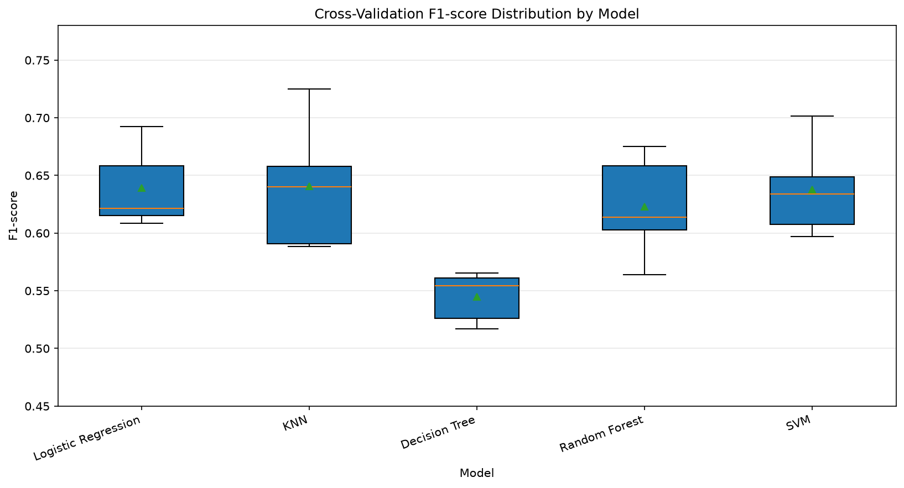

**Table 7. Diabetes Experiment 2: Random Forest max_depth.**

| max_depth | Mean CV F1 |
|---:|---:|
| 2 | 0.5513 |
| 4 | 0.6224 |
| 6 | **0.6462** |
| 8 | 0.6403 |
| None | 0.6227 |

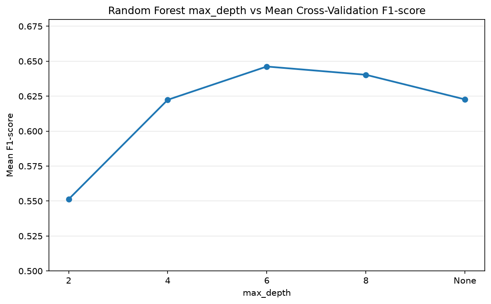

Depth 6 gives the highest mean training CV F1, 0.6462. Depth 2 is too restrictive under these conditions; increasing depth beyond 6 does not improve the mean. When depth 6 is fitted and evaluated on the held-out test set, F1 is 0.6061, below the unrestricted forest's initial holdout F1 of 0.6408. This is not an error: the depth was selected by average training-fold performance, and the holdout is a separate finite sample. Returning to the test set to choose unrestricted depth would leak evaluation information into model selection.

**Table 8. Diabetes Experiment 3: raw feature representation.**

| Representation | Raw features | Mean CV F1 | Std CV F1 |
|---|---:|---:|---:|
| Selected representation | 6 | **0.6462** | 0.0231 |
| All original inputs | 8 | 0.6243 | 0.0433 |

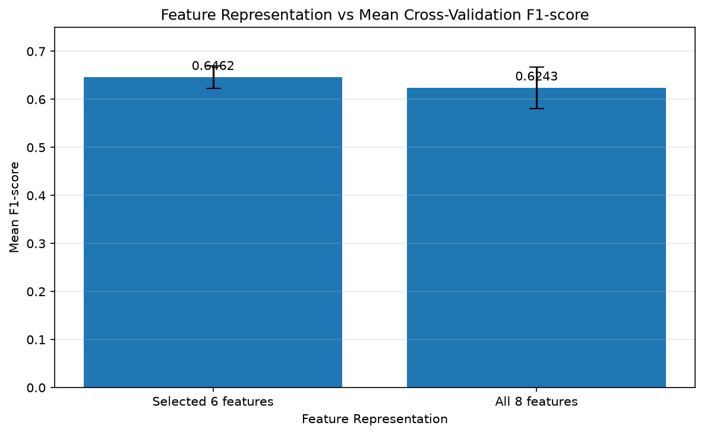

Adding SkinThickness and Insulin neither improves mean F1 nor reduces variability under the controlled procedure. More features are therefore not necessarily better. The result is specific to this dataset, missingness pattern, classifier, and validation design; it does not show that the two omitted measurements are intrinsically unimportant.

## 10.2 House Price Results

The `DummyRegressor(strategy="mean")` baseline produces MAE 1.8438, MSE 4.8760, RMSE 2.2082 billion VND, R² approximately 0, and MAPE 44.43%. Its near-zero R² is expected because it does not use property attributes.

**Table 9. House-price baseline and five-model holdout comparison.**

| Model | MAE | MSE | RMSE | R² | MAPE |
|---|---:|---:|---:|---:|---:|
| Baseline | 1.8438 | 4.8760 | 2.2082 | -0.0000 | 44.43% |
| Linear Regression | 1.4782 | 3.4039 | 1.8450 | 0.3019 | 32.93% |
| KNN | 1.3627 | 3.0777 | 1.7543 | 0.3688 | 29.31% |
| Decision Tree | 1.3976 | 3.6669 | 1.9149 | 0.2480 | 29.47% |
| Random Forest | 1.3009 | 2.9549 | 1.7190 | 0.3940 | 27.84% |
| SVR | 1.2868 | 2.7615 | 1.6618 | 0.4336 | 27.31% |

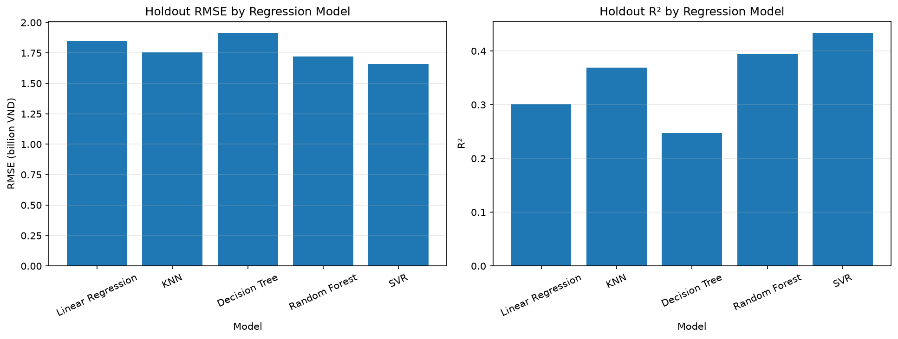

SVR is strongest on the descriptive holdout comparison. Training-only cross-validation confirms it as the strongest original configuration, with a small fold-to-fold spread.

**Table 10. House Price Experiment 1: five-model cross-validation.**

| Model | Mean CV RMSE | Std CV RMSE |
|---|---:|---:|
| SVR | **1.6565** | 0.0120 |
| Random Forest | 1.7130 | 0.0277 |
| KNN | 1.7601 | 0.0187 |
| Linear Regression | 1.8539 | 0.0239 |
| Decision Tree | 1.9365 | 0.0381 |

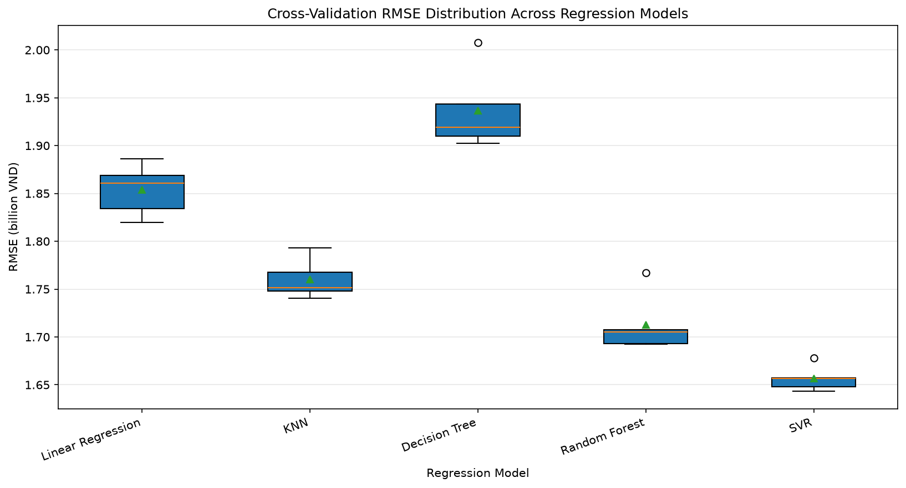

**Table 11. House Price Experiment 2: Random Forest max_depth.**

| max_depth | Mean CV RMSE | Std CV RMSE |
|---:|---:|---:|
| 4 | 1.8191 | 0.0109 |
| 8 | 1.6843 | 0.0138 |
| 12 | **1.6526** | 0.0189 |
| 16 | 1.6683 | 0.0258 |
| None | 1.7130 | 0.0277 |

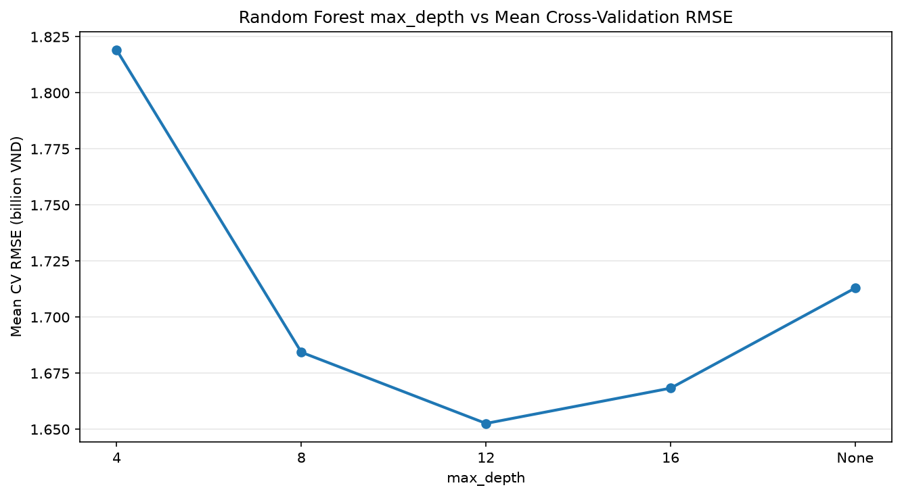

Depth 12 slightly improves upon the original SVR CV RMSE by 0.0039 billion VND. The difference is small and should not be overstated. Depth 4 underfits under these conditions; deeper forests increase the observed CV RMSE and variability.

**Table 12. House Price Experiment 3: raw feature representation.**

| Representation | Raw features | Mean CV RMSE | Std CV RMSE |
|---|---:|---:|---:|
| Compact representation | 6 | 1.6526 | 0.0189 |
| All usable attributes | 11 | **1.6078** | 0.0231 |

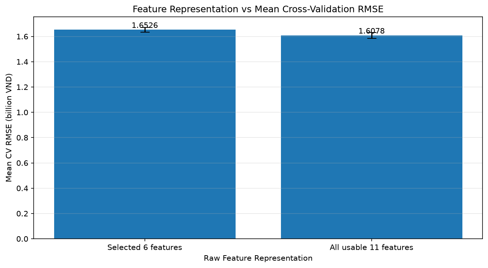

Unlike Diabetes, the additional usable House Price attributes improve the representation. Frontage, Access Road, both direction fields, and Furniture state reduce mean CV RMSE by approximately 0.0448 billion VND. Pipeline imputation allows their observed information to contribute without deleting rows.

# 11. Final Model Selection

## 11.1 Diabetes Final Model

The selected classifier is `RandomForestClassifier(n_estimators=100, max_depth=6, random_state=42)` with the six raw features. Its saved Pipeline applies median imputation, `StandardScaler`, and the forest. Selection is based on the best mean training CV F1 among tested depths and the better six-feature representation; the held-out test set is used once for final evaluation.

**Table 13. Diabetes final held-out metrics.**

| Metric | Value |
|---|---:|
| Accuracy | 0.7468 |
| Precision | 0.6667 |
| Recall | 0.5556 |
| F1-score | 0.6061 |

The final confusion matrix is `[[85, 15], [24, 30]]`: TN = 85, FP = 15, FN = 24, and TP = 30. A false negative is an actual class-1 observation classified as class 0; the 24 false negatives explain the limited recall of 0.5556. These are educational classification errors, not clinical outcomes.

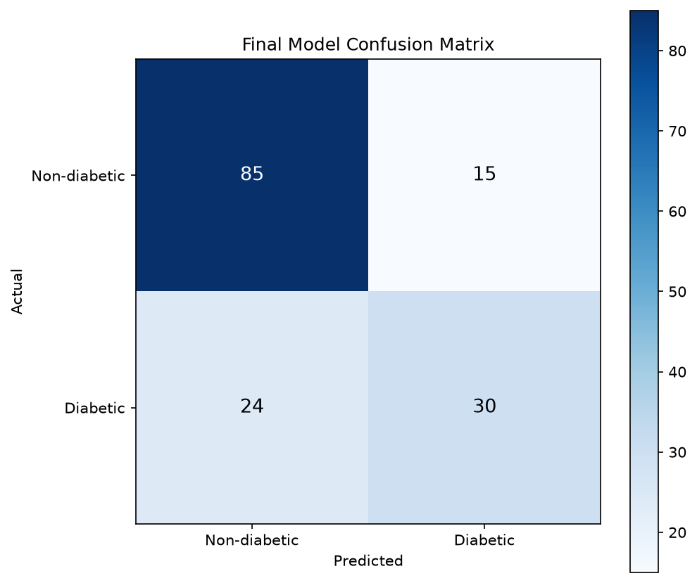

The model's impurity-based importance is highest for Glucose (0.4017), followed by BMI (0.1985), Age (0.1344), DiabetesPedigreeFunction (0.1244), Pregnancies (0.0767), and BloodPressure (0.0643). These values describe tree split usage in this fitted model and do not establish causal or clinical importance.

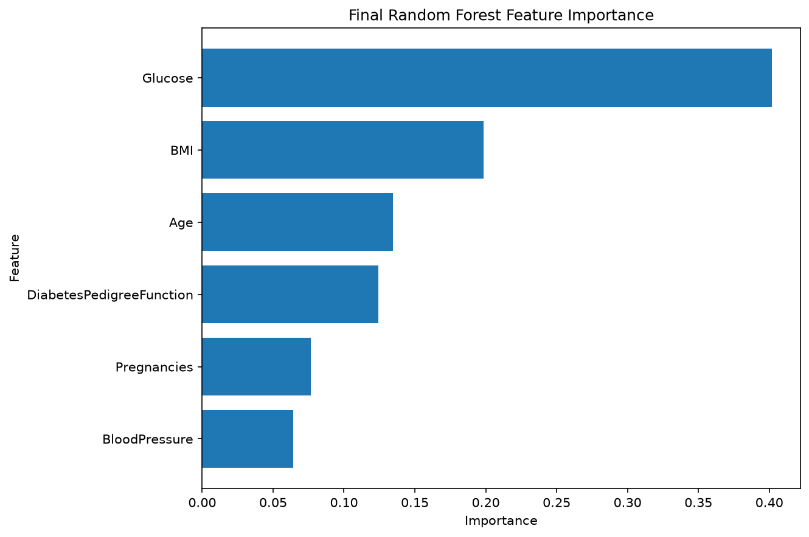

## 11.2 House Price Final Model

The selected regressor is `RandomForestRegressor(n_estimators=100, max_depth=12, random_state=42)` using all eleven raw property fields. Its saved Pipeline contains numerical median imputation/scaling, categorical most-frequent imputation/one-hot encoding, and the fitted forest.

**Table 14. House Price final held-out metrics.**

| Metric | Value |
|---|---:|
| MAE | 1.2529 billion VND |
| MSE | 2.5659 (billion VND)² |
| RMSE | 1.6018 billion VND |
| R² | 0.4738 |
| MAPE | 27.36% |

**R² = 0.4738 does not mean 47.38% accuracy.** It indicates that the fitted model explains approximately 47.38% of test-set price variance relative to the mean baseline. Regression does not use Accuracy, and the MAE/RMSE show that substantial listing-level uncertainty remains.

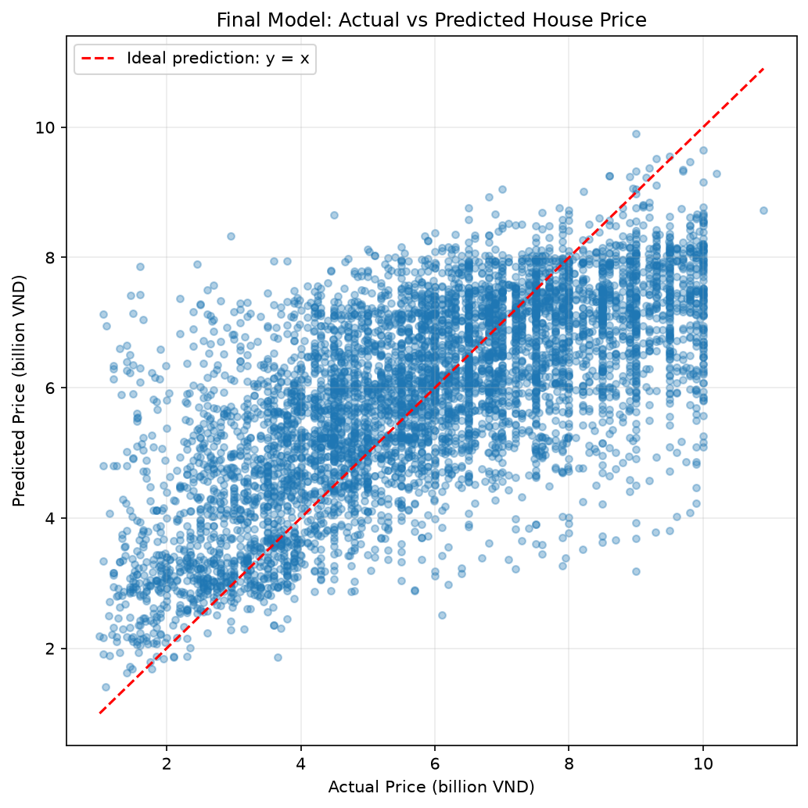

Predictions follow the general y = x direction but occupy a narrower range than actual values, consistent with regression toward the centre of the training distribution. The residual mean is -0.0255 billion VND, the median is -0.0803, and the residual standard deviation is 1.6016. Residuals range from -6.2601 to 5.8129 billion VND; the visible changing spread shows that individual errors remain material.

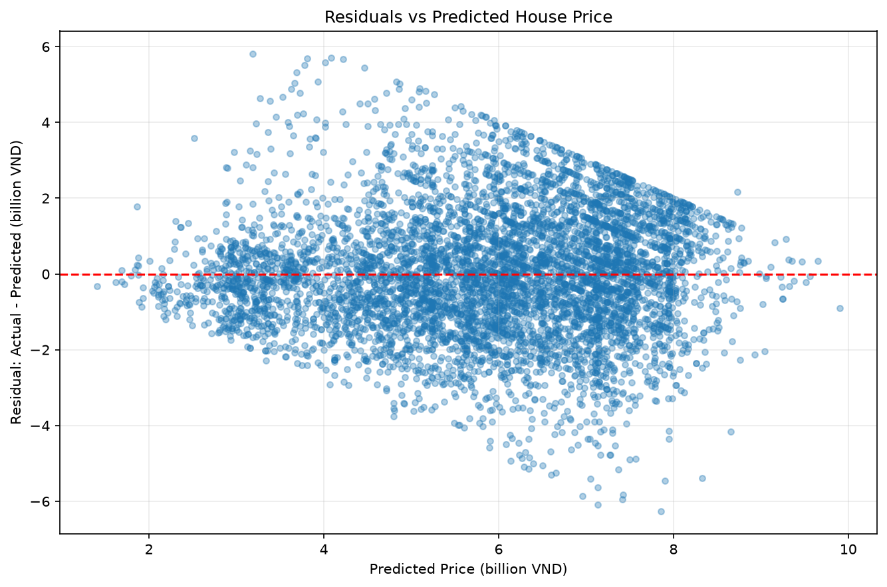

The strongest transformed feature importances are numeric Area (0.2856), Bathrooms (0.2226), Floors (0.1094), Access Road (0.0770), and the Hồ Chí Minh Province indicator (0.0676). Because categories expand into multiple encoded columns, these are encoded-feature values and are not incorrectly merged into raw-variable totals.

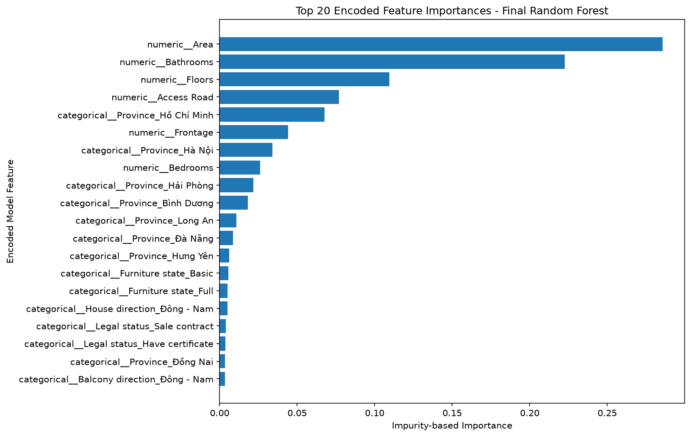

# 12. Intelligent Application Architecture

The application separates data-science artifacts from inference and presentation concerns. Executed notebooks create the trusted fitted Pipelines under `models/`. FastAPI loads both models once during application lifespan, validates their raw feature contracts against JSON metadata, and creates a one-row pandas DataFrame in the exact saved `feature_names_in_` order for each request. The API never refits a model or independently reconstructs preprocessing.

React/Vite and Expo React Native are thin clients. They request model metadata, render fields from the shared contract, submit raw values, and display the prediction plus limitations. Neo4j is independent from prediction availability: a graph connection failure changes graph status but does not prevent either model from loading or predicting.

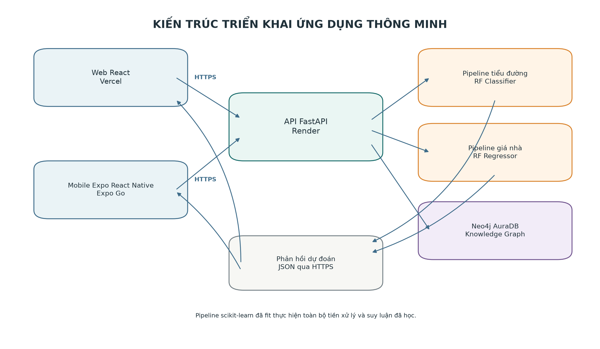

# 13. Backend and Model Inference

The backend uses Python, FastAPI, Pydantic, pandas, joblib, and scikit-learn Pipelines. Pydantic rejects missing or extra fields, invalid signs, blank categoricals, `NaN`, and infinite values. Request size is limited, CORS origins are environment-controlled, and model exceptions return a generic error rather than a raw traceback. Only repository-controlled joblib files are loaded.

The central invariant is **Training Pipeline = Inference Pipeline**. Diabetes inference calls the saved classifier's `predict` and `predict_proba`. House inference converts nullable raw fields to `numpy.nan`, permitting the fitted Pipeline to apply its learned imputation before `predict`. The backend does not call `fit`, `fit_transform`, `SimpleImputer`, `StandardScaler`, or `OneHotEncoder` during prediction.

**Table 15. Implemented FastAPI endpoints.**

| Method | Endpoint | Purpose | Main response |
|---|---|---|---|
| GET | `/health` | Service, model, and Neo4j status | Status object |
| GET | `/api/v1/models` | Metadata for both systems | Model collection |
| GET | `/api/v1/models/diabetes` | Diabetes feature/model contract | Metadata object |
| GET | `/api/v1/models/house-price` | House feature/model contract | Metadata object |
| POST | `/api/v1/diabetes/predict` | Educational classification | Class, label, probability |
| POST | `/api/v1/house-price/predict` | Educational listed-price estimate | Price and unit |
| GET | `/api/v1/diabetes/knowledge-graph` | Diabetes model/provenance graph | Nodes and edges |

# 14. Web Application

The web client uses React 19, Vite 7, and TypeScript. Routes provide Home, Diabetes, House Price, Knowledge Graph, and About pages. Shared metadata prevents the browser from hard-coding encoded features: the form sends the exact **raw** feature names expected by the backend, while the saved backend Pipeline performs imputation, scaling, and encoding. Responsive breakpoints adapt navigation, forms, result panels, cards, typography, and the graph layout for desktop, tablet, and phone widths.

The production web URL is <https://intelligent-system-assignment-01.vercel.app>. `VITE_API_BASE_URL` supplies the backend origin at build time. The Knowledge Graph page requests model-centric nodes and edges from FastAPI and renders them with a force-directed canvas. The canvas spaces nodes with configured forces, exposes relationship types as hover labels, provides an enlarged pointer area for every node, and synchronizes selection with an adjacent property panel.

# 15. Mobile Application

The mobile client uses Expo, React Native, and TypeScript. Its five screens are Home, Diabetes, House Price, Knowledge Graph, and About. The Diabetes and House screens obtain metadata and submit the same raw API contracts as the web application. The Knowledge Graph screen requests the existing graph endpoint and provides native node/relationship totals, a label legend, node property inspection, and navigable connections without depending on a desktop canvas. `EXPO_PUBLIC_API_BASE_URL` selects the backend URL appropriate to a browser, emulator, LAN-connected physical device, or deployed API.

The current mobile delivery is demonstrated through Expo Go. The repository does not claim a Google Play or Apple App Store release. Static project evidence confirms the prediction and Knowledge Graph request paths in a TypeScript type-checkable client; no independent store deployment is claimed.

# 16. Diabetes Knowledge Graph

The Neo4j AuraDB graph is transparent and model-centric. It records what the assignment system uses: the final model, six raw features, target, fitted preprocessing steps, dataset provenance, model-selection experiment, held-out metrics, and fitted impurity importance. It is **not a medical knowledge base** and contains no unsourced clinical claims.

The same sourced graph is presented differently for each interface: the web client uses an interactive force-directed canvas with a details panel, while the mobile client uses a touch-oriented node explorer and explicit connection list. Both views consume the same FastAPI response and preserve the same 17-node/17-relationship graph semantics.

**Table 16. Knowledge Graph schema represented in the Cypher seed.**

| Category | Values |
|---|---|
| Node labels | System; Model; Feature; Target; PipelineStep; Dataset; Experiment; Metric |
| Relationship types | USES_MODEL; USES_FEATURE; PREDICTS; HAS_PIPELINE_STEP; TRAINED_ON; EVALUATED_BY; SELECTED; COMPARES_REPRESENTATION |
| Scope property | `domain = "diabetes_assignment_01"` |
| Provenance detail | 768 observations; training-only 5-fold CV; held-out metrics |
| Interpretation boundary | Model transparency, not medical knowledge |

The Cypher uses `MERGE` and a uniqueness constraint on assignment entity keys. Production seeding was recorded twice with identical totals—17 nodes and 17 relationships after the first execution, and 17/17 after the second—demonstrating idempotence. A direct production API check for this report also returned 17 nodes and 17 relationships.

# 17. Deployment Architecture

GitHub is the source repository: <https://github.com/Sagitoaz/intelligent-system-assignment-01>. Render hosts FastAPI at <https://intelligent-system-assignment-01.onrender.com>. Vercel hosts the React web client at <https://intelligent-system-assignment-01.vercel.app>. Neo4j AuraDB hosts the Diabetes Knowledge Graph, and Expo Go supports mobile demonstration. Credentials, database passwords, Aura identifiers, and other secrets are intentionally excluded.

**Table 17. Direct production validation performed for this report.**

| Check | Observed result |
|---|---|
| `GET /health` | HTTP 200; status=ok; diabetes=loaded; house_price=loaded; neo4j=available |
| Diabetes notebook demo POST | HTTP 200; class 0; Non-diabetic; probability 0.01054453459068126 |
| House notebook demo POST | HTTP 200; 5.1266618454336434 billion VND; formatted 5.13 billion VND |
| Knowledge Graph GET | HTTP 200; 17 nodes; 17 relationships |
| Vercel web root | HTTP 200; application HTML returned |

These checks verify the backend prediction routes, graph retrieval, and web deployment at report-generation time. Mobile uses the same HTTPS endpoints through the code path documented above; this report does not claim a separately instrumented production mobile test beyond the current project evidence and Expo Go demonstration record. Free-tier hosting can introduce cold-start delay, so initial requests may be slower than subsequent requests.

# 18. System Demonstration

The notebooks include three synthetic cases for each fitted system. They use observed value ranges, are not copied from held-out rows, and pass directly through the complete saved Pipeline without manual preprocessing.

**Table 18. Diabetes notebook demonstration cases and outputs.**

| Case | Pregnancies | Glucose | BloodPressure | BMI | DPF | Age | Predicted class | Class-1 probability |
|---|---:|---:|---:|---:|---:|---:|---|---:|
| 1 | 1 | 85 | 66 | 24.0 | 0.20 | 23 | 0 – Non-diabetic | 0.0105 |
| 2 | 4 | 125 | 72 | 32.0 | 0.50 | 35 | 0 – Non-diabetic | 0.4105 |
| 3 | 8 | 180 | 80 | 38.0 | 1.20 | 55 | 1 – Diabetic | 0.8462 |

The labels demonstrate classifier mechanics only. They are not medical diagnoses, validated patient risk estimates, or healthcare advice.

**Table 19. House Price notebook demonstration cases and outputs.**

| Case | Province | Area | Frontage | Access Road | Directions (house/balcony) | Floors / Beds / Baths | Legal / Furniture | Predicted Price |
|---|---|---:|---:|---:|---|---|---|---:|
| 1 | Hồ Chí Minh | 45 | 4 | 4 | Đông - Nam / Đông - Nam | 3 / 3 / 3 | Have certificate / Full | 5.1267 billion VND |
| 2 | Bình Dương | 80 | 5 | 8 | Nam / Nam | 2 / 3 / 2 | Have certificate / Basic | 3.0945 billion VND |
| 3 | Hưng Yên | 90 | 6 | 13 | Đông - Bắc / Đông - Bắc | 5 / 5 / 5 | Sale contract / Full | 8.6189 billion VND |

These are educational listed-price estimates, not offers, transactions, appraisals, or investment advice. Reload tests in both notebooks confirm that saved-model predictions match the in-memory final Pipeline outputs.

# 19. Limitations

The Diabetes dataset contains only 768 observations and has limited population coverage. Missing measurements are encoded as zero, the target is imbalanced, and the final recall (0.5556) and F1 (0.6061) remain limited. The evaluation does not establish calibration, fairness, safety, prospective utility, external generalization, or clinically acceptable error costs. The system is not clinically validated and must remain an educational classification demonstration.

The house data consists of 2024 listings and is geographically concentrated, especially in Hồ Chí Minh and Hà Nội. Many attributes are missing, Address-to-Province extraction is an imperfect substitute for geocoding, and a listing price may differ from the actual transaction price. Market conditions change over time. Final RMSE remains 1.6018 billion VND, which is substantial for individual properties, so the output is not a professional valuation.

The application also has operational limitations. Free-tier cloud services may sleep or cold-start; network and third-party service availability affect the demonstration; graph availability is deliberately decoupled from prediction; and Expo Go is a demonstration environment rather than an app-store deployment. The entire system is an educational deployment, not evidence of clinical, commercial, or production readiness.

**Table 20. Principal limitation categories.**

| System | Data limitation | Model/evaluation limitation | Use boundary |
|---|---|---|---|
| Diabetes | 768 rows; hidden zeros; population limits; imbalance | Recall/F1 limited; no external/clinical validation | Not a medical diagnosis |
| House Price | 2024 listings; geographic concentration; missing attributes | RMSE 1.6018; listing ≠ transaction; market drift | Not professional valuation |
| Application | Free-tier services and network dependency | Cold starts; graph can be temporarily unavailable | Educational deployment; Expo Go demo |

# 20. Reflection

The majority-class Diabetes baseline is one of the most informative results: 64.94% Accuracy initially appears usable, yet Precision, Recall, and F1 are zero because every observation is predicted as the majority class. Evaluation must reflect the error that matters, not only the easiest aggregate score.

Representation has measurable consequences. The same tuned Diabetes forest performs better with six features than eight, showing that more inputs are not automatically better when missingness and finite sample size are present. The House system reaches the opposite empirical conclusion: five additional usable attributes improve mean CV RMSE from 1.6526 to 1.6078. Representation should therefore be tested for each problem rather than treated as a fixed preprocessing detail.

Cross-validation and a held-out test answer different questions. The depth-6 Diabetes forest is selected because it has the best average training-fold F1, even though its test F1 is below the initially observed unrestricted forest. Revising the choice after seeing that test difference would convert the test set into a tuning resource. Controlled experiments preserve the test boundary and make the decision reproducible.

The saved Pipeline connects experimental discipline to software reliability. It guarantees that training-time medians, scales, categories, and estimator parameters are exactly those used by FastAPI. Web and mobile remain clients of a raw-feature contract. This confirms the central lesson of the assignment: an intelligent system is more than `model.fit()`; it is a coordinated data, representation, evaluation, inference, interface, and deployment workflow.

# 21. Conclusion

Assignment 01 delivers two complete educational intelligent systems: Diabetes Classification and Vietnam House Price Regression. Both include dataset inspection, explicit representation, EDA, missing-data preprocessing, a baseline, five traditional machine-learning families, controlled experiments, final selection, a saved fitted Pipeline, FastAPI inference, a React web client, and an Expo React Native mobile client. Diabetes additionally includes a deployed Neo4j model/provenance Knowledge Graph.

The final Diabetes system uses a six-feature depth-6 Random Forest and achieves held-out Accuracy 0.7468, Precision 0.6667, Recall 0.5556, and F1 0.6061. The final House Price system uses eleven raw features and a depth-12 Random Forest, achieving MAE 1.2529, RMSE 1.6018 billion VND, R² 0.4738, and MAPE 27.36%. These results demonstrate a coherent assignment workflow; they do not establish clinical, professional valuation, commercial, or production readiness.

# 22. Reproducibility

The executed notebooks record Python 3.12.0, pandas 3.0.5, NumPy 2.5.2, matplotlib 3.11.1, scikit-learn 1.9.0, and joblib 1.5.3. Random splits, shuffled KFold, Decision Trees, and Random Forests use `random_state=42` where supported. Diabetes uses a stratified 80/20 split; House Price uses an 80/20 split and shuffled five-fold training CV. Fitted preprocessing lives inside every validation fold and inside the saved joblib artifact.

**Table 21. Reproducibility and runtime toolchain.**

| Layer | Main tools / versions evidenced by project |
|---|---|
| Notebook ML | Python 3.12.0; pandas 3.0.5; NumPy 2.5.2; matplotlib 3.11.1; scikit-learn 1.9.0; joblib 1.5.3 |
| Backend | FastAPI; Uvicorn; Pydantic; pandas; NumPy; scikit-learn; Neo4j driver |
| Web | Node.js 20+; React 19; Vite 7; TypeScript 5.9 |
| Mobile | Expo 54; React Native 0.81; React 19; TypeScript 5.9 |
| Report | Python; python-docx 1.2.0; native DOCX text, headings, and tables |

From the repository root, the documented commands are:

```text
python -m venv .venv
.\.venv\Scripts\Activate.ps1
python -m pip install -r backend\requirements.txt
$env:PYTHONPATH = "backend"
uvicorn app.main:app --reload --host 0.0.0.0 --port 8000

Set-Location web
npm install
npm run dev

Set-Location ..\mobile
npm install
npx expo start
```

Validation commands are `python -m pytest` with `PYTHONPATH=backend`, `npm run lint`, `npm run build`, and mobile `npm run typecheck`. The report can be rebuilt without modifying application dependencies:

```text
.venv\Scripts\python.exe -m pip install -r docs\report\requirements-report.txt
.venv\Scripts\python.exe docs\report\build_report.py
```

# 23. References

1. Kaggle. *Diabetes dataset used by the executed assignment notebook*. The notebook records Kaggle as the source but does not store a specific dataset-card URL; no author or publication metadata is inferred.
2. Kaggle. *Vietnam Housing Dataset 2024*. <https://www.kaggle.com/datasets/nguyentiennhan/vietnam-housing-dataset-2024>.
3. scikit-learn developers. *scikit-learn documentation*. <https://scikit-learn.org/stable/>.
4. FastAPI. *FastAPI documentation*. <https://fastapi.tiangolo.com/>.
5. Meta Open Source. *React documentation*. <https://react.dev/>.
6. Vite. *Vite documentation*. <https://vite.dev/>.
7. Expo. *Expo documentation*. <https://docs.expo.dev/>.
8. Neo4j. *Neo4j documentation*. <https://neo4j.com/docs/>.
9. Render. *Render documentation*. <https://render.com/docs>.
10. Vercel. *Vercel documentation*. <https://vercel.com/docs>.
11. Assignment source repository. <https://github.com/Sagitoaz/intelligent-system-assignment-01>.

# Appendix A – API Endpoints

**Table 22. Detailed API contract summary.**

| Method and path | Request | Success response | Important failure modes |
|---|---|---|---|
| `GET /health` | None | Service, both model states, Neo4j state | Service unavailable/network error |
| `GET /api/v1/models` | None | Both metadata objects | 500 unexpected server error |
| `GET /api/v1/models/diabetes` | None | Six raw fields, model, metrics, disclaimer | 500 unexpected server error |
| `GET /api/v1/models/house-price` | None | Eleven raw fields, categories, target, model | 500 unexpected server error |
| `POST /api/v1/diabetes/predict` | Exact six-field JSON | Class, label, probability, model, disclaimer | 413 payload; 422 validation; 500 prediction |
| `POST /api/v1/house-price/predict` | Exact eleven-key JSON; nullable optional measurements | Price, unit, formatted value, model, disclaimer | 413 payload; 422 validation; 500 prediction |
| `GET /api/v1/diabetes/knowledge-graph` | None | Node and edge arrays | 503 Neo4j unavailable |

Diabetes request keys are case-sensitive and ordered in the saved feature contract: `Pregnancies`, `Glucose`, `BloodPressure`, `BMI`, `DiabetesPedigreeFunction`, `Age`. House request keys are `Province`, `Area`, `Frontage`, `Access Road`, `House direction`, `Balcony direction`, `Floors`, `Bedrooms`, `Bathrooms`, `Legal status`, `Furniture state`. Unknown extra keys are rejected.

# Appendix B – Project Structure

```text
data/                 Diabetes and Vietnam housing CSV datasets
notebooks/            Executed Diabetes and House Price notebooks
models/               Saved fitted sklearn Pipelines
figures/              Notebook-generated evaluation figures
backend/              FastAPI app, metadata, services, schemas, and tests
web/                  React/Vite/TypeScript client
mobile/               Expo React Native/TypeScript client
knowledge_graph/      Idempotent Neo4j Cypher and graph documentation
docs/                 Architecture, API, and this technical report
```

The report deliverables are `docs/report/TECHNICAL_REPORT.md`, `docs/report/TECHNICAL_REPORT.docx`, `docs/report/build_report.py`, report-only requirements, and the two generated diagram assets. Notebook, model, backend, web, mobile, and knowledge-graph source files are not modified by report generation.

# Appendix C – Demo Input Cases

**Table 23. Complete Diabetes demo inputs from the executed notebook.**

| Field | Case 1 | Case 2 | Case 3 |
|---|---:|---:|---:|
| Pregnancies | 1 | 4 | 8 |
| Glucose | 85 | 125 | 180 |
| BloodPressure | 66 | 72 | 80 |
| BMI | 24.0 | 32.0 | 38.0 |
| DiabetesPedigreeFunction | 0.20 | 0.50 | 1.20 |
| Age | 23 | 35 | 55 |
| Predicted class | 0 | 0 | 1 |
| Label | Non-diabetic | Non-diabetic | Diabetic |

**Table 24. Complete House Price demo inputs from the executed notebook.**

| Field | Case 1 | Case 2 | Case 3 |
|---|---|---|---|
| Province | Hồ Chí Minh | Bình Dương | Hưng Yên |
| Area | 45.0 | 80.0 | 90.0 |
| Frontage | 4.0 | 5.0 | 6.0 |
| Access Road | 4.0 | 8.0 | 13.0 |
| House direction | Đông - Nam | Nam | Đông - Bắc |
| Balcony direction | Đông - Nam | Nam | Đông - Bắc |
| Floors | 3.0 | 2.0 | 5.0 |
| Bedrooms | 3.0 | 3.0 | 5.0 |
| Bathrooms | 3.0 | 2.0 | 5.0 |
| Legal status | Have certificate | Have certificate | Sale contract |
| Furniture state | Full | Basic | Full |
| Predicted Price | 5.1267 | 3.0945 | 8.6189 billion VND |
