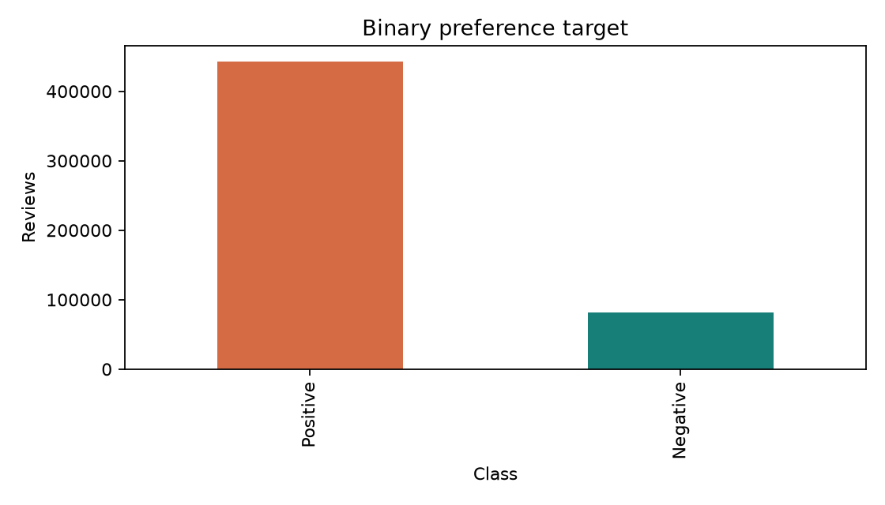
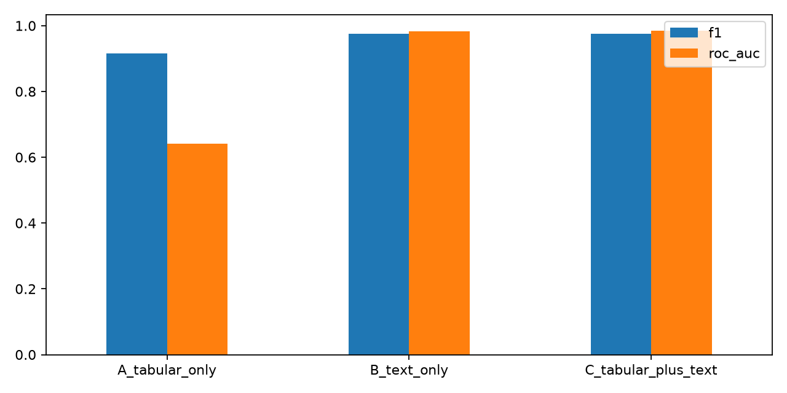
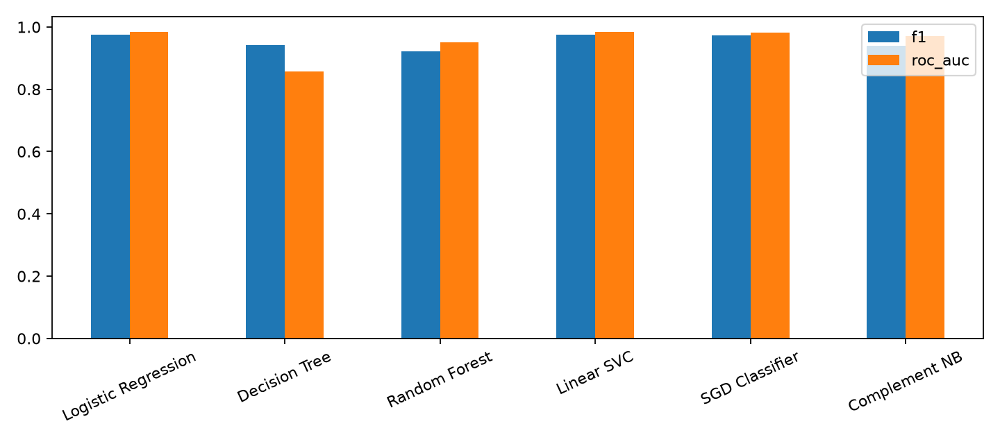
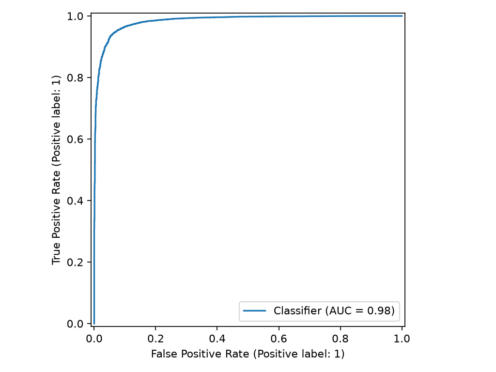
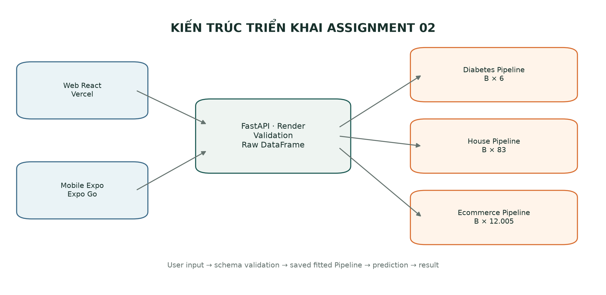
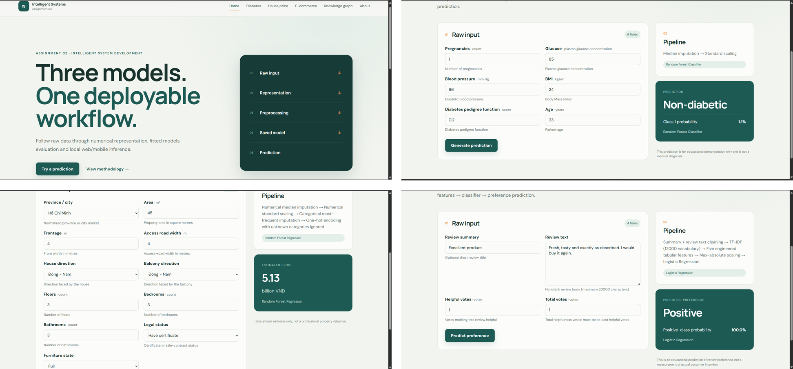
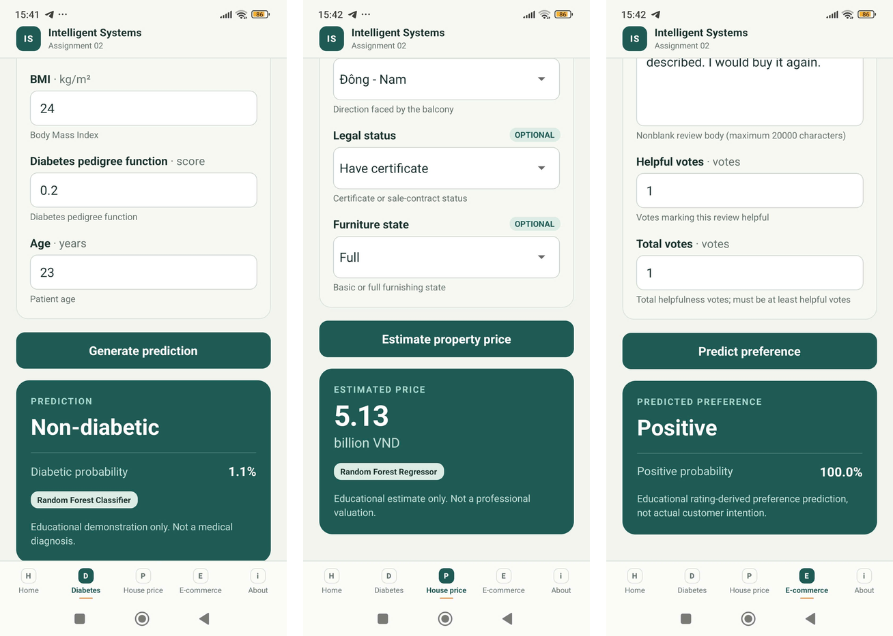
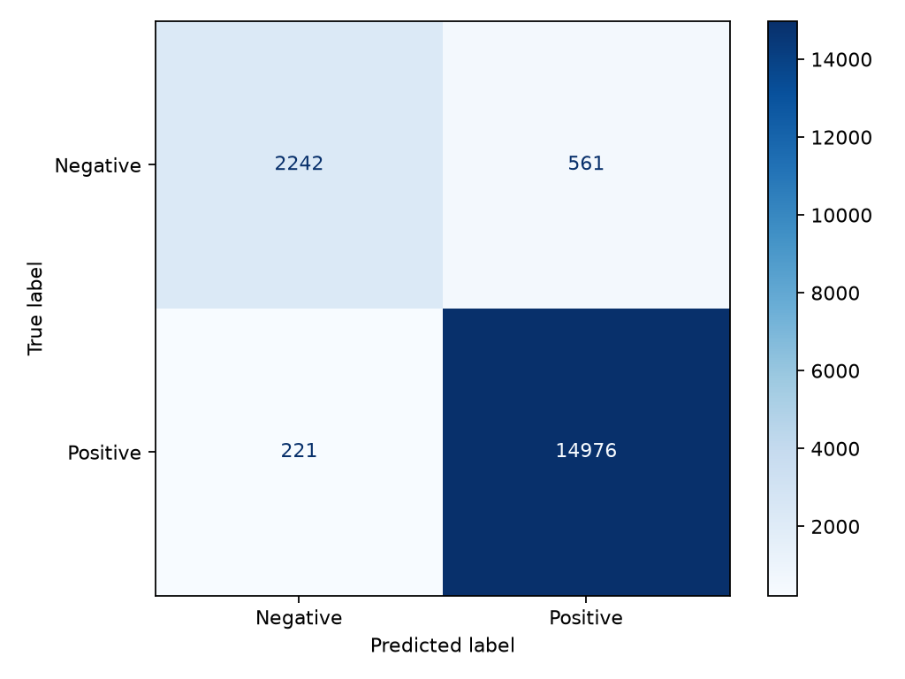

# HỌC VIỆN CÔNG NGHỆ BƯU CHÍNH VIỄN THÔNG

## INTELLIGENT SYSTEM DEVELOPMENT

## BÀI TẬP 02

### FROM DATA REPRESENTATION TO A DEPLOYABLE INTELLIGENT SYSTEM

**Sinh viên:** Nguyễn Thành Trung

**Mã sinh viên:** B23DCCN861

**Lớp:** D23CTPM01-B

**Giảng viên:** Dinh Que Tran, Ph.D., Assoc. Prof.

**Năm:** 2026

---

## Tóm tắt

Báo cáo trình bày ba hệ thống học máy end-to-end: phân loại Diabetes, hồi quy Vietnam House Price và phân loại E-commerce Customer Preference. Trọng tâm của Assignment 02 là mối liên hệ giữa dữ liệu thô, biểu diễn số, thí nghiệm mô hình, artifact đã lưu và ứng dụng có thể triển khai. Ba bài toán khác nhau về modality, target và metric nhưng dùng chung nguyên tắc: preprocessing được fit trên training data, đóng gói cùng estimator trong `Pipeline`, lưu bằng joblib và tái sử dụng nguyên trạng trong FastAPI, Web React và Mobile Expo.

Kết quả test cuối là: Diabetes Accuracy 0,7468 và F1 0,6061; House MAE 1,2529 tỷ VND, RMSE 1,6018 tỷ VND và R² 0,4738; Ecommerce Accuracy 0,9566, F1 0,9746 và ROC-AUC 0,9842. Các con số được lấy từ executed notebook outputs và persisted artifacts, không chạy lại training trong giai đoạn lập báo cáo. Web được triển khai trên Vercel, backend trên Render; Mobile được minh họa bằng Expo React Native/Expo Go. Neo4j chỉ là phần mở rộng độc lập của Diabetes và không phải yêu cầu cốt lõi.

# 1. Giới thiệu

Một hệ thống thông minh triển khai được không kết thúc ở việc chọn model. Hệ thống phải định nghĩa đúng một observation, tạo representation có ý nghĩa, kiểm soát leakage, đánh giá trên dữ liệu chưa nhìn thấy, lưu toàn bộ phép biến đổi đã học và giữ hợp đồng input nhất quán giữa notebook với application. Repository giải quyết chuỗi này cho ba bài toán có tính chất khác nhau.

Mục tiêu của báo cáo là trả lời bốn câu hỏi: dữ liệu thô là gì; dữ liệu trở thành numerical representation như thế nào; bằng chứng nào dẫn tới lựa chọn model; và persisted `Pipeline` được phục vụ cho người dùng ra sao. Báo cáo không xem dự đoán Diabetes là chẩn đoán, không gọi R² của House là Accuracy, không gọi TF-IDF là embedding và không diễn giải probability Ecommerce như độ chắc chắn về hành vi mua.

# 2. Tổng quan ba hệ thống

| Tiêu chí | Diabetes | House Price | E-commerce Preference |
|---|---|---|---|
| Problem type | Binary classification | Regression | Binary text classification |
| Observation | Một hồ sơ bệnh nhân | Một tin đăng bất động sản | Một review của user cho product |
| Target | `Outcome` 0/1 | `Price`, tỷ VND | `Score`-derived Negative/Positive |
| Dataset | 768 quan sát | 30.229 tin đăng | 568.454 review thô |
| Raw feature | 6 numerical | 11 numerical/categorical | 2 text + 2 helpfulness counts |
| Numerical representation | Median + scaling | Median/mode + scaling + one-hot | TF-IDF + 5 engineered values |
| Final dimension | `B × 6` | `B × 83` | `B × 12.005` |
| Final model | Random Forest Classifier | Random Forest Regressor | Logistic Regression |
| Main metric | Recall/F1, kèm Accuracy | MAE/RMSE/R²/MAPE | F1 và ROC-AUC |
| Vấn đề dữ liệu | Hidden zero, imbalance | Missing, Address, skew/outlier | Neutral target, duplicate, imbalance |
| Triển khai | FastAPI/Web/Mobile | FastAPI/Web/Mobile | FastAPI/Web/Mobile |
| Hạn chế chính | Dataset nhỏ, không lâm sàng | Listing không phải transaction | Rating proxy không phải customer intent |

Bảng cho thấy “feature count” ở form và “model dimension” không nhất thiết bằng nhau. Diabetes giữ sáu numerical dimensions. House có 11 trường thô nhưng categorical one-hot làm tăng lên 83. Ecommerce chỉ có bốn trường API nhưng vocabulary 12.000 term và năm feature tabular tạo 12.005 chiều sparse.

# 3. Nguồn dữ liệu và xác định bài toán

## 3.1 Diabetes

Dataset local có 768 hàng và target `Outcome`: 500 quan sát lớp 0, 268 quan sát lớp 1. Tỷ lệ này tạo class imbalance vừa phải, vì vậy baseline Accuracy có thể cao dù không phát hiện lớp Diabetic. Sáu feature cuối là `Pregnancies`, `Glucose`, `BloodPressure`, `BMI`, `DiabetesPedigreeFunction`, `Age`. `SkinThickness` và `Insulin` không thuộc representation cuối vì tỷ lệ hidden-zero lớn và thí nghiệm 6-vs-8 feature cho thấy bộ sáu feature có CV F1 trung bình tốt và ổn định hơn.

## 3.2 Vietnam House Price

Dataset Kaggle Vietnam Housing 2024 có 30.229 hàng. Target `Price` là giá niêm yết theo tỷ VND, không phải giá giao dịch. Dữ liệu trộn numerical và categorical; nhiều trường thiếu, đặc biệt Balcony direction, House direction và Furniture state. `Address` có cardinality cao nên được biến đổi xác định thành `Province`, tạo 60 nhãn chuẩn hóa và không còn Province missing.

## 3.3 E-commerce Customer Preference

Amazon Fine Food Reviews có 568.454 dòng thô. Quy tắc target là `Score` 4–5 → Positive, 1–2 → Negative, còn Score 3 bị loại. Sau khi loại 42.640 neutral rows, 2 helpfulness records không hợp lệ và 829 duplicate reviews, còn 524.983 dòng usable. Stratified modeling sample có 120.000 dòng, gồm 18.686 Negative và 101.314 Positive. `Score` chỉ tạo target rồi bị loại khỏi `X`; `Id`, `ProductId`, `UserId`, `ProfileName` và `Time` không phải predictive input. Đây là ranh giới quan trọng chống leakage và ghi nhớ identifier.

# 4. Biểu diễn dữ liệu

| Ứng dụng | Dữ liệu thô | Biểu diễn số | Model input |
|---|---|---|---|
| Diabetes | CSV numerical patient record | Hidden-zero handling, median-imputed, standardized vector | `X ∈ R^(B×6)` |
| House | CSV mixed numerical/categorical listing | Numerical scaling + categorical one-hot | `X ∈ R^(B×83)` |
| Ecommerce | Review text + helpfulness counts | TF-IDF 12.000 + 5 numerical values | `X ∈ R^(B×12.005)` |

Trong bảng, `B` là số observations được suy luận cùng lúc. Với Ecommerce, `V=12.000` là vocabulary size, `d_tabular=5`, do đó `d_final=V+d_tabular=12.005`. Với House, `d_raw=11` nhưng `d_encoded=83` vì mỗi category trở thành một hoặc nhiều indicator columns. Người dùng vẫn chỉ nhập raw fields; application không gửi encoded vector.

## 4.1 Bằng chứng code: hidden-zero của Diabetes

```python
invalid_zero_columns = [
    "Glucose", "BloodPressure", "SkinThickness", "Insulin", "BMI"
]
df_clean[invalid_zero_columns] = (
    df_clean[invalid_zero_columns].replace(0, np.nan)
)
```

**Giải thích:** Code chỉ đổi zero thành missing cho các phép đo sinh lý mà zero không hợp lý. `Pregnancies=0` được giữ vì là giá trị có nghĩa. `SimpleImputer(strategy="median")` nằm trong `Pipeline`, nên median được học từ training folds thay vì toàn dataset.

**Phân tích kết quả:** Việc xử lý hidden zero ngăn model coi “không đo được” là mức sinh lý cực thấp. Nó cũng giải thích tại sao raw representation và clean representation khác nhau dù đều có sáu cột.

## 4.2 Bằng chứng code: Address thành Province

```python
def extract_province(address):
    if pd.isna(address):
        return np.nan
    normalized_address = unicodedata.normalize("NFC", str(address)).strip()
    components = [c.strip(" .") for c in normalized_address.split(",") if c.strip(" .")]
    province = components[-1] if components else np.nan
    return PROVINCE_ALIASES.get(province, province)

df_clean["Province"] = df_clean["Address"].apply(extract_province)
```

**Giải thích:** Thành phần địa lý cuối được chuẩn hóa Unicode và ánh xạ alias. Input là `Address`; output là một category `Province`. Phép biến đổi không đọc `Price`, nên không tạo target leakage.

**Phân tích kết quả:** Output notebook xác nhận 0 Province missing và 60 labels. Cách này giảm cardinality so với one-hot trực tiếp 10.265 địa chỉ, đồng thời vẫn giữ tín hiệu thị trường.

## 4.3 Bằng chứng code: TF-IDF và FeatureUnion

```python
text = Pipeline([
    ("combine_text", ReviewTextTransformer()),
    ("tfidf", TfidfVectorizer(
        max_features=12000, ngram_range=(1, 2), min_df=3,
        max_df=0.98, sublinear_tf=True, strip_accents="unicode",
        dtype=np.float32,
    )),
])
tabular = Pipeline([
    ("engineer", ReviewTabularTransformer()),
    ("scale", MaxAbsScaler()),
])
features = FeatureUnion([("text", text), ("tabular", tabular)])
```

**Giải thích:** `TfidfVectorizer` học vocabulary chỉ từ training data và tạo sparse unigram/bigram weights. Nhánh tabular tạo numerator, denominator, helpfulness ratio, review length, summary length; `MaxAbsScaler` giữ khả năng xử lý sparse. `FeatureUnion` ghép hai nhánh theo cột.

**Phân tích kết quả:** Token ID chỉ là vị trí trong vocabulary; TF-IDF vector chứa weighted term values; embedding là dense learned vector. Notebook không đồng nhất ba khái niệm. TF-IDF được chọn thay vì tensor Transformer `B×T×d` vì phù hợp CPU, 120.000 rows và deployment gọn; đổi lại nó mất phần lớn context ngoài bigram.

# 5. Tiền xử lý và EDA

Diabetes EDA xác nhận imbalance 500/268 và hidden zeros. Sau làm sạch, median imputation giảm ảnh hưởng outlier hơn mean; scaling giúp các model distance/linear được so sánh công bằng. Random Forest không cần scaling về mặt toán học, nhưng việc giữ preprocessing chung trong Pipeline giúp hợp đồng inference nhất quán.

House có Area lệch phải mạnh, missing values ở cả numerical/categorical và geographic imbalance. Outlier của Area không tự động là lỗi; các giá trị dương đến 595 m² có thể là tài sản lớn hợp lệ nên được giữ. Numerical branch dùng median imputation + scaling; categorical branch dùng most-frequent imputation + one-hot với unknown category ignored.

Ecommerce EDA cho thấy Positive chiếm ưu thế, review length có đuôi phải và helpfulness tập trung gần zero. Review dài được giữ; clipping chỉ dùng khi vẽ histogram. Exact duplicates được loại trước split. Các quyết định này dẫn đến stratification và đánh giá đa metric thay vì dựa vào Accuracy.



*Hình 1. Positive chiếm tỷ lệ lớn hơn rõ rệt; F1, ROC-AUC và confusion matrix cần được đọc cùng Accuracy.*

# 6. Phát triển và so sánh mô hình

## 6.1 Diabetes

Baseline dự đoán toàn bộ là Non-diabetic, đạt Accuracy 0,6494 nhưng Recall/F1 của lớp 1 bằng 0. Năm model gồm Logistic Regression, KNN, Decision Tree, Random Forest và SVM. Cross-validation trên training data giúp tránh dùng test để chọn cấu hình. Thí nghiệm `max_depth` cho CV F1 trung bình: depth 2 = 0,5513; 4 = 0,6224; 6 = 0,6462; sâu hơn không tạo lợi ích ổn định tương ứng. Thí nghiệm representation cho sáu feature CV F1 0,6462 so với tám feature 0,6243.

Random Forest không giới hạn đạt hold-out F1 0,6408, cao hơn final depth-6 F1 0,6061. Đây không phải lỗi: depth 6 được chọn trước bằng training-only CV nhằm cân bằng hiệu suất và độ phức tạp; test set không được dùng ngược để lựa chọn lại sau khi nhìn kết quả.


*Hình 2. CV training-only đạt cực đại ở depth 6, là bằng chứng cho cấu hình cuối.*

## 6.2 House Price

Baseline mean có MAE 1,8438 và RMSE 2,2082 tỷ VND. Các họ model A1 gồm Linear Regression, KNN, Decision Tree, Random Forest, SVR; Assignment 02 bổ sung Ridge và Gradient Boosting trên training folds nhưng không dùng test để thay artifact. Random Forest `max_depth=12` là điểm thấp nhất của CV RMSE trong thí nghiệm độ sâu. Mở rộng từ 6 lên 11 raw features giảm CV RMSE từ 1,6526 xuống 1,6078, vì Frontage, Access Road, directions và Furniture bổ sung tín hiệu.


*Hình 3. Biểu diễn 11 raw fields cải thiện CV RMSE và được chọn cho persisted Pipeline.*

## 6.3 Ecommerce

Controlled representation experiment giữ Logistic Regression và mọi điều kiện khác cố định:

| Representation | Accuracy | Precision | Recall | F1 | ROC-AUC |
|---|---:|---:|---:|---:|---:|
| Tabular only | 0,8442 | 0,8445 | 0,9994 | 0,9155 | 0,6410 |
| Text only | 0,9570 | 0,9627 | 0,9873 | 0,9749 | 0,9836 |
| Text + tabular | 0,9574 | 0,9631 | 0,9874 | 0,9751 | 0,9840 |

Text tạo gần như toàn bộ mức cải thiện; năm tabular features chỉ thêm một gain nhỏ. Chênh lệch Text-only và Combined không được thổi phồng.



*Hình 4. TF-IDF tạo cải thiện lớn so với tabular-only; Combined nhỉnh hơn Text-only ở mức nhỏ.*

Sáu model dùng cùng combined sparse matrix:

| Model | Accuracy | Precision | Recall | F1 | ROC-AUC |
|---|---:|---:|---:|---:|---:|
| Logistic Regression | 0,9574 | 0,9631 | 0,9874 | 0,9751 | **0,9840** |
| Decision Tree | 0,8989 | 0,9230 | 0,9604 | 0,9413 | 0,8568 |
| Random Forest | 0,8588 | 0,8567 | 1,0000 | 0,9228 | 0,9512 |
| Linear SVC | **0,9598** | 0,9703 | 0,9825 | **0,9764** | 0,9832 |
| SGD Classifier | 0,9531 | 0,9565 | 0,9894 | 0,9727 | 0,9828 |
| Complement NB | 0,9031 | 0,9847 | 0,8992 | 0,9400 | 0,9707 |

Linear SVC có F1 cao nhất; Logistic Regression không tốt nhất ở mọi metric. Logistic Regression được chọn vì F1 chỉ thấp hơn 0,0013, ROC-AUC cao nhất trong so sánh, có native probability và không cần calibration layer, nhờ đó đơn giản hơn cho API/UI.



*Hình 5. Linear SVC dẫn đầu F1, còn Logistic Regression thỏa selection rule có probability.*

# 7. Kết quả và phân tích

| Hệ thống | Final test metrics | Diễn giải |
|---|---|---|
| Diabetes | Accuracy 0,7468; Precision 0,6667; Recall 0,5556; F1 0,6061 | 30 TP, 24 FN; không phải chẩn đoán |
| House | MAE 1,2529; MSE 2,5659; RMSE 1,6018; R² 0,4738; MAPE 27,36% | Error theo tỷ VND; R² không phải Accuracy |
| Ecommerce | Accuracy 0,9566; Precision 0,9639; Recall 0,9855; F1 0,9746; ROC-AUC 0,9842 | Target là rating-derived proxy |

## 7.1 Diabetes

Confusion matrix `[[85, 15], [24, 30]]` cho 85 true negatives, 15 false positives, 24 false negatives và 30 true positives. False negative quan trọng trong bối cảnh sàng lọc, nhưng dataset nhỏ và output mang tính giáo dục; hệ thống không thể thay thế thăm khám.


*Hình 6. Recall lớp Diabetic 0,5556 phản ánh 24 trường hợp lớp 1 bị bỏ sót.*

## 7.2 House Price

MAE 1,2529 tỷ VND biểu thị sai lệch tuyệt đối trung bình theo thang giá gốc; RMSE 1,6018 phạt lỗi lớn mạnh hơn. R² 0,4738 nghĩa là mô hình giải thích khoảng 47,38% phương sai giá trên test set, **không phải 47,38% Accuracy**. MAPE 27,36% cung cấp góc nhìn tương đối nhưng vẫn bị ảnh hưởng bởi mức giá.


*Hình 7. Điểm phân tán quanh đường lý tưởng cho thấy tín hiệu dự đoán có thật nhưng sai số còn đáng kể.*

Residual mean -0,0255 tỷ VND và tương quan residual–prediction 0,0189 gần zero, cho thấy signed bias tổng thể nhỏ. Tuy vậy, dispersion vẫn lớn ở từng listing; feature importance dựa trên impurity chỉ mô tả model, không chứng minh quan hệ nhân quả.

## 7.3 Ecommerce

Final confusion matrix `[[2242, 561], [221, 14976]]` cho Recall Positive rất cao 0,9855. Tuy nhiên Positive chiếm đa số nên cần xem thêm negative recall 0,7999, ROC-AUC và error examples. False positives/negatives thường liên quan câu ngắn, mixed sentiment hoặc rating/text không nhất quán.



*Hình 8. ROC-AUC 0,9842 cho khả năng xếp hạng hai lớp tốt trên test sample; không biến proxy target thành customer intent thật.*

# 8. Kiến trúc hệ thống và triển khai



*Hình 9. Web Vercel và Mobile Expo gửi raw input qua HTTPS tới FastAPI Render; backend validation rồi gọi một trong ba persisted Pipelines.*

## 8.1 Liên kết sản phẩm đã triển khai và mã nguồn

- **Ứng dụng Web (Vercel):** [https://intelligent-system-assignment-01.vercel.app](https://intelligent-system-assignment-01.vercel.app)
- **Backend API (Render):** [https://intelligent-system-assignment-01.onrender.com](https://intelligent-system-assignment-01.onrender.com)
- **Tài liệu API production:** [https://intelligent-system-assignment-01.onrender.com/docs](https://intelligent-system-assignment-01.onrender.com/docs)
- **Repository GitHub:** [https://github.com/Sagitoaz/intelligent-system-assignment-01](https://github.com/Sagitoaz/intelligent-system-assignment-01)

Production Web: `https://intelligent-system-assignment-01.vercel.app`. Production Backend: `https://intelligent-system-assignment-01.onrender.com`. FastAPI tải ba joblib artifacts một lần trong lifespan. Metadata xác định raw fields; Pydantic từ chối unknown/invalid fields; service tạo một-row `DataFrame` đúng thứ tự `feature_names_in_` rồi gọi `predict`/`predict_proba`. Không có `fit` tại inference.

Web React/Vite và Mobile Expo dùng cùng REST contract. Vercel route rewrite cho phép direct refresh. CORS cho phép production Vercel origin một cách explicit. Ecommerce artifact phụ thuộc các custom classes trong `shared_ml/ecommerce_transformers.py`, được copy/import trên Render; production health đã xác nhận cả ba model loaded.

Neo4j Diabetes Knowledge Graph được giữ như extension từ Assignment 01. Nó độc lập với prediction pipeline và không phải yêu cầu cốt lõi Assignment 02. Tại thời điểm kiểm tra báo cáo, production Neo4j unavailable nên báo cáo không khẳng định graph đang live và không dùng screenshot Knowledge Graph.

# 9. Minh chứng Web và Mobile

## 9.1 Web production



*Hình 10. Composite dùng nguyên bốn screenshot thật `Home.png`, `Diabetes.png`, `HousePricing.png`, `Ecommerce.png`. Các form gửi raw fields tới Render; kết quả lần lượt thể hiện ba hệ thống và không expose encoded vector.*

## 9.2 Mobile Expo



*Hình 11. Composite dùng ba screenshot thật `diabetes2.png`, `house4.png`, `e2.png`. Mỗi ảnh giữ nguyên portrait ratio, hiển thị prediction result và dùng cùng production-compatible API contract.*

# 10. So sánh ba hệ thống

Diabetes là representation nhỏ nhất và dễ deploy nhất, nhưng dataset chỉ có 768 observations và domain y tế đòi hỏi diễn giải thận trọng. House có modality tabular hỗn hợp; one-hot làm tăng số chiều nhưng vẫn dense vừa phải. Ecommerce có dataset và dimension lớn nhất; sparse matrix là điều kiện kỹ thuật để controlled comparison khả thi.

Classification Diabetes cần quan tâm FN và Recall; regression House đo magnitude lỗi bằng MAE/RMSE và explained variance bằng R²; classification Ecommerce cần F1/ROC-AUC vì imbalance. Không thể dùng một metric chung để xếp hạng ba hệ thống. Điểm chung là `Pipeline` giữ phép biến đổi đã học, kiểm soát leakage và tạo contract ổn định giữa notebook và application.

# 11. Hạn chế và thảo luận

Diabetes dựa trên observational dataset nhỏ, hidden zeros và sáu measurements; feature importance không phải causal evidence. Output không phải medical diagnosis. House dùng listing price thay vì transaction price, thiếu nhiều thuộc tính và có geographic imbalance; prediction không phải professional valuation. Ecommerce target là proxy suy ra từ rating, Positive imbalance mạnh và có thể còn near-duplicate/user/product dependence; probability không phải certainty về intention.

Đánh giá hold-out phản ánh đúng split hiện tại nhưng không thay cho external validation. Các model có thể suy giảm khi distribution thay đổi, xuất hiện category mới hoặc văn phong review khác. Monitoring, model cards, data versioning và privacy review là hướng mở rộng hợp lý nhưng nằm ngoài phạm vi Assignment 02.

# 12. Kết luận

Ba hệ thống chứng minh một workflow thống nhất từ raw data đến deployment trong khi vẫn tôn trọng đặc thù từng bài toán. Diabetes tạo vector `B×6`; House biến 11 raw fields thành `B×83`; Ecommerce ghép TF-IDF và numerical features thành sparse `B×12.005`. Controlled experiments giải thích lựa chọn representation và model, còn persisted Pipelines bảo đảm inference không tái triển khai preprocessing bằng tay.

Assignment 02 đạt mục tiêu kỹ thuật chính: notebook có bằng chứng executed, model được lưu nguyên vẹn, backend phục vụ ba contract, Web/Mobile dùng raw inputs, và production deployment hoạt động cho prediction. Các limitation và disclaimer được giữ rõ để kết quả không bị diễn giải vượt quá bằng chứng.

# Tài liệu tham khảo

1. Đề bài Assignment 02, *From Data Representation to a Deployable Intelligent System*, tài liệu môn học Intelligent System Development, 2026.
2. Kaggle, *Pima Indians Diabetes Database*. URL được README ghi nhận; provenance card gốc chưa được lưu cùng notebook Assignment 01.
3. Kaggle, *Vietnam Housing Dataset 2024*: https://www.kaggle.com/datasets/nguyentiennhan/vietnam-housing-dataset-2024
4. Kaggle, *Amazon Product Reviews / Amazon Fine Food Reviews*: https://www.kaggle.com/datasets/arhamrumi/amazon-product-reviews
5. scikit-learn documentation: https://scikit-learn.org/stable/
6. FastAPI documentation: https://fastapi.tiangolo.com/
7. React documentation: https://react.dev/
8. Expo documentation: https://docs.expo.dev/
9. Vercel documentation: https://vercel.com/docs
10. Render documentation: https://render.com/docs

# Phụ lục A — Diabetes Notebook Evidence

Phụ lục này chọn các cell đại diện trong notebook Diabetes thay vì sao chép toàn bộ 110 code cells. Mỗi bằng chứng đi theo chuỗi **đoạn mã → output đã lưu → giải thích → phân tích → quyết định**. Notebook executed và artifact hiện có được đọc làm source of truth; không có thao tác huấn luyện lại trong quá trình lập báo cáo.

## A.1 Khảo sát dataset và target

**Đoạn mã A.1 — Đọc dữ liệu và xác nhận kích thước**

```python
df = pd.read_csv(DATA_PATH)
rows, columns = df.shape
print("Number of observations:", rows)
print("Number of columns:", columns)
df.head()
```

**Giải thích mã:** `read_csv` tạo một observation cho mỗi hàng; `shape` kiểm tra quy mô trước mọi phép biến đổi. `head` cho phép đối chiếu tên cột và kiểu giá trị thực tế thay vì suy đoán schema.

**Kết quả thực thi:**

```text
Number of observations: 768
Number of columns: 9
Columns: Pregnancies, Glucose, BloodPressure, SkinThickness,
         Insulin, BMI, DiabetesPedigreeFunction, Age, Outcome
Class counts: Outcome 0 = 500; Outcome 1 = 268
Class percentages: 65.1% và 34.9%
```

**Phân tích kết quả:** Chín cột gồm tám candidate inputs và target `Outcome`. Chênh lệch 500–268 tạo mất cân bằng vừa phải: một bộ phân loại luôn trả lớp 0 vẫn đạt Accuracy gần 65%. Vì vậy các thí nghiệm phía sau phải đọc đồng thời Precision, Recall, F1-score và confusion matrix.

**Ý nghĩa đối với bước tiếp theo:** Target được tách khỏi `X`; split sử dụng `stratify=y` để giữ tỷ lệ lớp giữa train và test. Baseline majority-class được giữ làm mốc nhằm phát hiện trường hợp Accuracy cao nhưng không nhận diện lớp Diabetic.

## A.2 Hidden-zero và ý nghĩa của missing measurement

**Đoạn mã A.2 — Đếm zero ở các phép đo sinh lý**

```python
zero_check_columns = [
    "Glucose", "BloodPressure", "SkinThickness", "Insulin", "BMI"
]
zero_summary = pd.DataFrame({
    "Zero Count": (df[zero_check_columns] == 0).sum(),
    "Zero Percentage (%)": ((df[zero_check_columns] == 0).mean() * 100).round(2)
})
```

**Kết quả thực thi:**

```text
               Zero Count  Zero Percentage (%)
Glucose                 5                 0.65
BloodPressure          35                 4.56
SkinThickness         227                29.56
Insulin               374                48.70
BMI                    11                 1.43
```

**Giải thích mã:** Kiểm tra `isna()` ban đầu trả zero missing values, nhưng giá trị số 0 ở những phép đo trên không hợp lý về sinh lý và thực chất biểu diễn “không đo được”. Code tách riêng danh sách này để tránh áp dụng quy tắc một cách mù quáng cho mọi cột.

**Phân tích kết quả:** `SkinThickness` và `Insulin` có tỷ lệ hidden-zero lần lượt 29,56% và 48,70%, cao hơn rõ rệt ba phép đo còn lại. Ngược lại, `Pregnancies=0` là trạng thái hợp lệ nên không được đổi thành missing. Nếu đổi zero của `Pregnancies`, mô hình sẽ làm mất thông tin có nghĩa; nếu giữ zero của `Insulin`, scaler và model sẽ coi missing measurement như một mức insulin cực thấp.

**Ý nghĩa đối với bước tiếp theo:** Các zero không hợp lý được đổi thành `NaN`, sau đó imputation diễn ra bên trong Pipeline. Mức thiếu rất lớn của `SkinThickness` và `Insulin` là một bằng chứng thực nghiệm hỗ trợ việc so sánh representation sáu và tám feature thay vì mặc định “nhiều feature hơn luôn tốt hơn”.

**Đoạn mã A.3 — Chuyển zero không hợp lý thành missing**

```python
invalid_zero_columns = [
    "Glucose", "BloodPressure", "SkinThickness", "Insulin", "BMI"
]
df_clean[invalid_zero_columns] = (
    df_clean[invalid_zero_columns].replace(0, np.nan)
)
```

```text
Glucose            5
BloodPressure     35
SkinThickness    227
Insulin          374
BMI               11
```

**Phân tích kết quả:** Số `NaN` sau biến đổi khớp chính xác bảng zero count, chứng minh phép làm sạch chỉ thay đổi các giá trị đã xác định. Không hàng nào bị xóa ở bước này.

## A.3 Representation sáu feature và Pipeline chống leakage

**Đoạn mã A.4 — Xác định raw representation cuối**

```python
selected_features = [
    "Pregnancies", "Glucose", "BloodPressure", "BMI",
    "DiabetesPedigreeFunction", "Age"
]
X = df_clean[selected_features].copy()
y = df_clean["Outcome"].copy()
```

Mỗi observation trước preprocessing là một vector sáu giá trị. Sau hidden-zero handling, median imputation và scaling, shape vẫn là `B×6`; các phép biến đổi chỉ thay giá trị chứ không sinh thêm cột. `B` là số hồ sơ được suy luận cùng lúc, còn 6 là số raw numerical features đã chốt.

**Đoạn mã A.5 — Pipeline tiền xử lý và classifier**

```python
preprocessor = Pipeline([
    ("imputer", SimpleImputer(strategy="median")),
    ("scaler", StandardScaler())
])

final_model = Pipeline([
    ("preprocessor", preprocessor),
    ("model", RandomForestClassifier(
        n_estimators=100, max_depth=6, random_state=42
    ))
])
```

**Giải thích mã:** `SimpleImputer` học median và `StandardScaler` học mean/standard deviation khi Pipeline được `fit`. Trong cross-validation, mỗi training fold học thống kê riêng; validation fold chỉ đi qua `transform`. Artifact lưu cả hai transformer và classifier.

**Kết quả thực thi:** Split có 614 training samples và 154 testing samples; tỷ lệ lớp lần lượt xấp xỉ 0,651/0,349 và 0,649/0,351. Persisted model tải lại cho demo predictions `[0, 0, 1]`, bằng predictions trước khi lưu.

**Ý nghĩa đối với bước tiếp theo:** Tại inference, API chỉ tạo DataFrame sáu cột rồi gọi `predict`/`predict_proba`; không fit imputer, scaler hoặc model. Đây là ranh giới chống leakage và chống sai khác giữa notebook với production.

## A.4 Baseline và so sánh năm mô hình

| Model | Accuracy | Precision | Recall | F1-score |
|---|---:|---:|---:|---:|
| Baseline | 0,6494 | 0,0000 | 0,0000 | 0,0000 |
| Logistic Regression | 0,7013 | 0,5909 | 0,4815 | 0,5306 |
| KNN | 0,7338 | 0,6327 | 0,5741 | 0,6019 |
| Decision Tree | 0,6818 | 0,5510 | 0,5000 | 0,5243 |
| Random Forest không giới hạn depth | 0,7597 | 0,6735 | 0,6111 | 0,6408 |
| SVM | 0,7338 | 0,6512 | 0,5185 | 0,5773 |

**Phân tích kết quả:** Baseline cho thấy trực tiếp nguy cơ của Accuracy: 0,6494 nhưng Recall và F1 đều bằng 0 vì mọi bệnh nhân đều bị gán Non-diabetic. Năm model học được đều nhận diện một phần lớp 1. Random Forest không giới hạn depth có F1 holdout 0,6408 cao nhất trong bảng mô tả này, nhưng đây chưa phải bằng chứng hợp lệ để chọn hyperparameter cuối vì cùng test split đã được nhìn thấy trong so sánh.

**Ý nghĩa đối với bước tiếp theo:** Các cấu hình được so sánh lại bằng training-only cross-validation. F1 được ưu tiên hơn Accuracy vì nó buộc model cân bằng giữa Precision và Recall của lớp Diabetic.

## A.5 Controlled experiments: depth và 6-vs-8 feature

**Đoạn mã A.6 — Cross-validation theo max_depth**

```python
rf_depth_6_scores = cross_val_score(
    rf_depth_6, X_train, y_train, cv=5, scoring="f1"
)
print(rf_depth_6_scores)
print("Mean F1-score:", round(rf_depth_6_scores.mean(), 4))
```

```text
max_depth=2     mean CV F1 = 0.5513
max_depth=4     mean CV F1 = 0.6224
max_depth=6     mean CV F1 = 0.6462
max_depth=8     mean CV F1 = 0.6403
max_depth=None  mean CV F1 = 0.6227
Best max_depth: 6; Best mean F1-score: 0.6462
```

**Phân tích kết quả:** Depth 2 underfit. Hiệu suất tăng đến depth 6 rồi giảm nhẹ ở depth 8 và mô hình không giới hạn. Vì mọi điểm số này được tính trên năm folds thuộc 614 training observations, depth 6 được chọn mà không dùng test set.

```text
Selected 6 features: mean CV F1 = 0.6462; std = 0.0231
All 8 features:      mean CV F1 = 0.6243; std = 0.0433
```

**Phân tích kết quả:** Sáu feature vừa có mean F1 cao hơn khoảng 0,022 vừa có độ lệch chuẩn thấp hơn. Hai feature thêm vào không tạo cải thiện trong điều kiện được kiểm soát; lượng missing-measurement lớn là một nguyên nhân hợp lý nhưng không được diễn giải như quan hệ nhân quả đã chứng minh.

**Quyết định:** Final representation giữ sáu feature và final classifier giữ `max_depth=6`.

## A.6 Final test và giải thích CV so với holdout

```text
Final test metrics
Accuracy   0.7468
Precision  0.6667
Recall     0.5556
F1-score   0.6061

Final Confusion Matrix
[[85 15]
 [24 30]]
```

**Phân tích kết quả:** Ma trận có 85 TN, 15 FP, 24 FN và 30 TP. Hai mươi bốn false negatives làm Recall chỉ còn 0,5556: trong test set, model nhận diện đúng 30 trên 54 observations lớp 1. Đây là limitation quan trọng hơn việc chỉ nhìn Accuracy 0,7468.

Unrestricted Random Forest từng đạt holdout F1 0,6408, cao hơn final depth-6 test F1 0,6061. Việc vẫn giữ depth 6 là chủ đích khoa học: hyperparameter đã được chọn từ training-only CV, nơi depth 6 đạt 0,6462 còn unrestricted model đạt 0,6227. Quay lại đổi model sau khi nhìn test result sẽ biến test thành tuning set và làm đánh giá lạc quan. Hai con số trả lời hai câu hỏi khác nhau: CV hỗ trợ lựa chọn trong training data; held-out test ước lượng hiệu suất cuối của lựa chọn đã đóng băng.

Kết quả chỉ minh họa hệ thống phân loại học thuật. Dataset nhỏ, không đại diện đầy đủ cho mọi dân số và chưa được xác thực lâm sàng; prediction không phải chẩn đoán y khoa.

# Phụ lục B — House Price Notebook Evidence

## B.1 Dataset, observation và target

**Đoạn mã B.1 — Đọc dữ liệu và kiểm tra schema**

```python
df = pd.read_csv(DATA_PATH)
rows, columns = df.shape
print("Number of observations:", rows)
print("Number of columns:", columns)
print(df.columns.tolist())
```

```text
Number of observations: 30229
Number of columns: 12
Address, Area, Frontage, Access Road, House direction,
Balcony direction, Floors, Bedrooms, Bathrooms,
Legal status, Furniture state, Price
```

**Giải thích và phân tích:** Mỗi hàng là một tin đăng, không phải một giao dịch hoàn tất. `Price` là target liên tục theo tỷ VND; 11 cột còn lại là candidate raw inputs. Target có minimum 1,0, maximum 11,5, mean 5,8721, median 5,9 và skewness -0,029 trong dataset đã dùng. Vì đây là regression, báo cáo dùng MAE, MSE, RMSE, R² và MAPE; không có khái niệm Accuracy cho giá nhà.

## B.2 Missingness và quyết định giữ observation

**Đoạn mã B.2 — Missing-value ledger**

```python
missing_summary = pd.DataFrame({
    "Missing Count": df.isna().sum(),
    "Missing Percentage (%)": (df.isna().mean() * 100).round(2)
})
```

**Kết quả thực thi:**

```text
Frontage             11564 missing
Access Road          13297 missing
House direction      21239 missing
Balcony direction    24983 missing
Floors                3603 missing
Bedrooms              5162 missing
Bathrooms             7074 missing
Legal status           4506 missing
Furniture state       14119 missing
```

**Phân tích kết quả:** Nếu drop mọi row có missing, phần lớn 30.229 observations sẽ biến mất và distribution có thể đổi theo cơ chế missing. Notebook giữ toàn bộ rows hợp lệ về target, rồi đặt imputation trong Pipeline. Numerical columns dùng median để giảm nhạy với outlier; categorical columns dùng mode để tạo category hợp lệ trước one-hot encoding.

## B.3 Từ Address cardinality cao đến Province

**Đoạn mã B.3 — Trích xuất và chuẩn hóa Province**

```python
def extract_province(address):
    if pd.isna(address):
        return np.nan
    normalized_address = unicodedata.normalize("NFC", str(address)).strip()
    components = [
        component.strip(" .")
        for component in normalized_address.split(",")
        if component.strip(" .")
    ]
    province = components[-1] if components else np.nan
    return PROVINCE_ALIASES.get(province, province)

df_clean["Province"] = df_clean["Address"].apply(extract_province)
```

**Giải thích mã:** `Address` có 10.265 unique values, quá chi tiết để one-hot trực tiếp trong phạm vi dataset này. Hàm chuẩn hóa Unicode, lấy thành phần sau dấu phẩy cuối và gom alias đã biết. Đây là parsing xác định, không phải geocoding và không suy ra tọa độ.

**Kết quả thực thi:** Dataset sau làm sạch vẫn có 30.229 rows, zero row dropped và zero missing target. Province tạo được 60 nhãn chuẩn hóa; Hồ Chí Minh và Hà Nội chiếm phần lớn observations.

**Ý nghĩa:** Province giảm cardinality, tạo representation ổn định hơn và vẫn giữ tín hiệu thị trường theo địa lý. Geographic imbalance còn lại được ghi là limitation thay vì xem preprocessing là đã giải quyết hoàn toàn.

## B.4 ColumnTransformer và 11→83 dimensions

**Đoạn mã B.4 — Hai nhánh preprocessing**

```python
def create_preprocessor(numeric_features, categorical_features):
    numeric_pipeline = Pipeline([
        ("imputer", SimpleImputer(strategy="median")),
        ("scaler", StandardScaler())
    ])
    categorical_pipeline = Pipeline([
        ("imputer", SimpleImputer(strategy="most_frequent")),
        ("onehot", OneHotEncoder(handle_unknown="ignore"))
    ])
    return ColumnTransformer([
        ("numeric", numeric_pipeline, numeric_features),
        ("categorical", categorical_pipeline, categorical_features)
    ])
```

**Giải thích mã:** Numerical và categorical columns cần phép biến đổi khác nhau nên được định tuyến bằng `ColumnTransformer`. Không dùng `LabelEncoder` cho Province/hướng/trạng thái vì integer code sẽ tạo thứ tự giả. `handle_unknown="ignore"` khiến category mới ở inference trở thành vector zero trong nhóm tương ứng thay vì làm API crash.

**Kết quả thực thi:**

```text
original df shape = (30229, 12)
raw model fields = 11
example raw shape = (1, 11)
transformed representation shape = (1, 83)
```

**Phân tích kết quả:** Người dùng nhập 11 fields nhưng model nhận 83 numerical columns. Các numerical features vẫn đóng góp một cột mỗi feature; categorical categories mở rộng thành nhiều one-hot indicators. Do đó `B×11` là raw form còn `B×83` mới là model input.

## B.5 Model comparison và representation experiment

Các preserved comparisons gồm Linear Regression, KNN, Decision Tree, Random Forest và SVR. Trên holdout mô tả ban đầu, SVR có RMSE 1,6618 và R² 0,4336, tốt hơn Random Forest chưa tinh chỉnh với RMSE 1,7190 và R² 0,3940. Tuy nhiên final selection không quay lại tối ưu trên bảng holdout này; notebook dùng training-only CV cho depth và representation.

Assignment 02 bổ sung hai benchmark training-fold:

| Model | CV MAE | CV RMSE | CV R² | Training time (s) |
|---|---:|---:|---:|---:|
| Ridge Regression | 1,4531 | 1,8206 | 0,3230 | 0,6530 |
| Gradient Boosting | 1,3045 | 1,6375 | 0,4523 | 13,6325 |

```text
6 selected features: mean CV RMSE = 1.6526
11 usable features:  mean CV RMSE = 1.6078
```

**Phân tích kết quả:** Khác Diabetes, việc thêm năm raw fields House làm CV RMSE giảm khoảng 0,0448 tỷ VND. Các thuộc tính frontage, access road, directions và furniture bổ sung tín hiệu đủ để bù cho missingness sau imputation. Thí nghiệm chỉ thay representation, giữ split, estimator và CV strategy cố định nên chênh lệch có thể gắn với feature set trong điều kiện này.

Depth experiment cho Random Forest đạt CV RMSE thấp nhất tại `max_depth=12` trong các giá trị 4, 8, 12, 16 và None. Final pipeline vì thế dùng 11 raw fields cùng depth 12; quyết định dựa trên training folds, không dựa trên final test.

## B.6 Final evaluation, residual và limitation

```python
final_model = Pipeline([
    ("preprocessor", create_preprocessor(
        final_numeric_features, final_categorical_features
    )),
    ("model", RandomForestRegressor(
        n_estimators=100, max_depth=12, random_state=42
    ))
])
```

```text
MAE   = 1.2529 tỷ VND
MSE   = 2.5659 (tỷ VND)²
RMSE  = 1.6018 tỷ VND
R²    = 0.4738
MAPE  = 0.2736 = 27.36%
```

**Phân tích kết quả:** MAE trả lời sai lệch tuyệt đối trung bình trên thang giá gốc. RMSE lớn hơn MAE vì phạt mạnh các lỗi lớn. R² 0,4738 cho biết tỷ lệ phương sai giá được giải thích trên test split; đây tuyệt đối không phải “Accuracy 47,38%”. MAPE cung cấp góc nhìn tương đối nhưng không thay thế sai số tuyệt đối hàng tỷ đồng.


*Hình 12. Residual mean -0,0255 và tương quan residual–prediction 0,0189 gần zero cho thấy signed bias tổng thể nhỏ, nhưng độ phân tán vẫn lớn ở từng tin đăng.*

Actual-vs-predicted và residual plot cùng cho thấy regression toward the mean: predicted range hẹp hơn actual range, các bất động sản ở biên dễ có lỗi lớn hơn. Giá niêm yết không phải giá giao dịch; thiếu tọa độ, thời điểm thị trường và chất lượng nội thất chi tiết. Vì vậy output là ước lượng giáo dục, không phải thẩm định chuyên nghiệp.

# Phụ lục C — Ecommerce Notebook Evidence

## C.1 Dataset, cleaning ledger và sampling

**Đoạn mã C.1 — Đọc file nguồn thực tế**

```python
df = pd.read_csv(root / "data/ecommerce/Reviews.csv")
print("filename:", path.name)
print("shape:", df.shape)
df.head()
```

```text
filename: Reviews.csv
shape: (568454, 10)
```

**Phân tích kết quả:** 568.454 là raw dataset size, không phải modeling sample. Quy mô này cùng representation văn bản 12.000 chiều khiến sparse matrix trở thành yêu cầu kỹ thuật; tạo dense matrix sẽ lãng phí bộ nhớ rất lớn.

**Đoạn mã C.2 — Target, record validation và duplicate removal**

```python
work = raw.loc[valid_score & raw["Score"].ne(3)].copy()
work["target"] = work["Score"].isin([4, 5]).astype(int)
nonblank = work["Text"].astype(str).str.strip().ne("")
helpful = (
    (work["HelpfulnessNumerator"] >= 0)
    & (work["HelpfulnessDenominator"] >= 0)
    & (work["HelpfulnessNumerator"] <= work["HelpfulnessDenominator"])
)
duplicate = work.duplicated(
    subset=["ProductId", "UserId", "Score", "Summary", "Text"],
    keep="first"
)
work = work.loc[nonblank & helpful & ~duplicate].copy()
```

```text
raw_rows                     568454
neutral_removed               42640
invalid_helpfulness_removed       2
duplicate_reviews_removed       829
usable_rows                  524983
modeling_rows                120000
splits: train 84000; validation 18000; test 18000
```

**Giải thích mã:** Score 1–2 tạo target 0 (Negative), Score 4–5 tạo target 1 (Positive), còn Score 3 bị loại vì trung tính. Quan hệ helpfulness phải thỏa `0 ≤ numerator ≤ denominator`. Duplicate review keys được loại trước split để cùng nội dung không xuất hiện ở nhiều tập.

**Ý nghĩa:** `Score` hoàn thành vai trò tạo `y` rồi bị loại khỏi `X`. Nếu giữ Score, model chỉ học lại quy tắc label và tạo target leakage trực tiếp. Modeling sample 120.000 được lấy stratified với `random_state=42`; split 70/15/15 giữ tỷ lệ lớp và tách validation khỏi final test.

## C.2 Raw fields và identifier exclusion

```text
Raw model fields:
['Summary', 'Text', 'HelpfulnessNumerator', 'HelpfulnessDenominator']
```

`Id`, `ProductId`, `UserId`, `ProfileName` và `Time` không được dùng làm predictive inputs. Các identifier có thể cho phép model ghi nhớ user/product xuất hiện trong sample thay vì học nội dung có khả năng khái quát. Việc loại chúng không đảm bảo loại hết mọi phụ thuộc user/product, nhưng loại bỏ con đường leakage/memorization rõ nhất trong contract triển khai.

Modeling distribution gồm 18.686 Negative và 101.314 Positive. Positive chiếm khoảng 84,43%, vì vậy majority baseline có Accuracy 0,8443 và Recall Positive 1,0 nhưng negative recall bằng 0. Đây là lý do controlled experiments báo cáo đồng thời Precision, Recall, F1 và ROC-AUC.

## C.3 Review thật, token IDs và TF-IDF values

Notebook lấy một review thật từ test split, không phải câu được tạo cho báo cáo:

```text
Summary: Yummy and Fast!
Text (rút gọn): This is a high quality scone mix. I love scones ...
Tokens đầu tiên:
['yummy', 'and', 'fast', 'this', 'is', 'high', 'quality',
 'scone', 'mix', 'love', 'scones', 'and', 'never', 'seem',
 'to', 'have', 'time', 'to', 'make', 'them']
Token IDs thực:
yummy=11989, and=433, fast=3407, this=10245, is=5069,
high=4687, quality=7905, mix=6278, love=5942, never=6579
```

**Phân tích:** Token ID chỉ là vị trí của term trong fitted vocabulary. ID 11989 của `yummy` không có nghĩa “tích cực hơn” ID 433 của `and`; khoảng cách giữa IDs cũng không có ý nghĩa ngữ nghĩa.

**Đoạn mã C.3 — TF-IDF branch**

```python
text = Pipeline([
    ("combine_text", ReviewTextTransformer()),
    ("tfidf", TfidfVectorizer(
        max_features=12000,
        ngram_range=(1, 2),
        min_df=3,
        max_df=0.98,
        sublinear_tf=True,
        strip_accents="unicode",
        dtype=np.float32,
    )),
])
```

```text
Non-zero TF-IDF values của review thật:
actually      index 144   value 0.088363
also          index 313   value 0.109509
and           index 433   value 0.067020
and cream     index 488   value 0.161221
and fast      index 515   value 0.157541
and never     index 605   value 0.140527
```

**Giải thích:** Fitted vectorizer biến một document thành sparse vector `B×V`, với `V=12.000`. Chỉ các unigram/bigram xuất hiện có non-zero weights. Vocabulary được fit từ training data trong Pipeline, nên validation/test không đóng góp document frequency.

**TF-IDF khác embedding:** Lecture flow tổng quát có thể là text → tokens → token IDs → embedding tensor `B×T×d`. Implementation này dùng text → tokens → vocabulary → TF-IDF matrix `B×V`. TF-IDF sparse, dễ giải thích, phù hợp classical linear models và CPU deployment; nó không phải learned dense embedding và không giữ đầy đủ thứ tự/ngữ cảnh như Transformer.

## C.4 Năm engineered values và final dimension

**Đoạn mã C.4 — Tabular transformer**

```python
ratio = numerator / denominator.clip(lower=1)
return np.column_stack([
    numerator.to_numpy(float),
    denominator.to_numpy(float),
    ratio.to_numpy(float),
    body.str.split().str.len().to_numpy(float),
    summary.str.split().str.len().to_numpy(float),
])
```

Năm values gồm helpfulness numerator, denominator, ratio, review word count và summary word count. Mẫu số được chặn tối thiểu 1 để trường hợp 0/0 hợp lệ không gây division-by-zero. `FeatureUnion` ghép `12.000` text columns với `5` numerical columns, tạo `X_final ∈ R^(B×12005)`. API vẫn chỉ nhận bốn raw fields; 12.005 dimensions được tái tạo hoàn toàn bên trong persisted Pipeline.

## C.5 Controlled representation comparison

| Representation | Accuracy | Precision | Recall | F1 | ROC-AUC |
|---|---:|---:|---:|---:|---:|
| Tabular only | 0,8442 | 0,8445 | 0,9994 | 0,9155 | 0,6410 |
| Text only | 0,9570 | 0,9627 | 0,9873 | 0,9749 | 0,9836 |
| Text + tabular | 0,9574 | 0,9631 | 0,9874 | 0,9751 | 0,9840 |

**Phân tích kết quả:** Khi classifier, rows, split và random state được giữ cố định, text làm ROC-AUC tăng từ 0,6410 lên 0,9836 và F1 tăng từ 0,9155 lên 0,9749. Đây là nguồn cải thiện chính. Combined representation chỉ tăng F1 khoảng 0,0003 so với Text-only và ROC-AUC khoảng 0,0004; mức tăng nhất quán nhưng rất nhỏ, không được diễn giải như bước nhảy lớn.

**Quyết định:** Combined được giữ vì nó đứng đầu cả ba metrics chính trong controlled comparison và năm numerical values rẻ khi inference. Tuy nhiên kết luận trung thực là nội dung text mang phần lớn predictive information.

## C.6 Sáu model và selection rule

| Model | Accuracy | Precision | Recall | F1 | ROC-AUC | Fit (s) |
|---|---:|---:|---:|---:|---:|---:|
| Linear SVC | 0,9598 | 0,9703 | 0,9825 | **0,9764** | 0,9832 | 3,16 |
| Logistic Regression | 0,9574 | 0,9631 | 0,9874 | 0,9751 | **0,9840** | 3,48 |
| SGD Classifier | 0,9531 | 0,9576 | 0,9877 | 0,9727 | 0,9828 | 0,55 |
| Decision Tree | 0,8989 | 0,9410 | 0,9415 | 0,9413 | 0,8568 | 47,38 |
| Complement NB | 0,9031 | 0,8925 | 0,9930 | 0,9400 | 0,9707 | 0,05 |
| Random Forest | 0,8588 | 0,8582 | 0,9980 | 0,9228 | 0,9512 | 5,56 |

**Phân tích kết quả:** Linear SVC có validation F1 cao nhất 0,9764; vì vậy Logistic Regression không phải model tốt nhất ở mọi metric. Khoảng cách F1 chỉ 0,0013, trong khi Logistic Regression có ROC-AUC cao nhất 0,9840 và cung cấp `predict_proba` native. Selection rule chỉ xét probability-capable models nằm trong 0,01 của best F1, rồi dùng ROC-AUC làm tie-breaker.

**Quyết định:** Logistic Regression được chọn để giữ performance gần best, trả probability trực tiếp và tránh calibration layer bổ sung. Decision Tree vừa chậm nhất trong bảng vừa có ROC-AUC thấp; Random Forest cấu hình sparse này thiên mạnh về Positive và không cạnh tranh về F1.

## C.7 Final evaluation, confusion matrix và error evidence

```text
Selected: Logistic Regression
Accuracy   0.9566
Precision  0.9639
Recall     0.9855
F1         0.9746
ROC-AUC    0.9842
Confusion matrix [[2242, 561], [221, 14976]]
```



*Hình 13. Có 561 false positives và 221 false negatives; Recall Positive cao nhưng negative errors vẫn phải được đọc trong bối cảnh class imbalance.*

**Phân tích kết quả:** Model nhận diện 14.976 Positive reviews và bỏ sót 221; Recall 0,9855 vì vậy rất cao. Tuy nhiên Positive là lớp đa số, nên Accuracy 0,9566 không đủ để mô tả chất lượng. ROC-AUC 0,9842 đo khả năng xếp hạng trên test sample, không phải certainty về hành vi mua.

`error_examples.csv` cho thấy lỗi có bằng chứng thuộc nhiều dạng. Review “Pleases picky cat!...for awhile.” mở đầu tích cực nhưng cập nhật sau nói sản phẩm làm thú cưng bị ốm; target từ Score 2 là Negative trong khi model trả Positive. “PUMPKIN SPICE K-CUPS” có Score 5 nhưng nội dung chứa disappointment và ý không mua lại, nên model trả Negative. “Great Chips” có văn bản tích cực rõ nhưng Score 1 tạo target Negative, trong khi model trả Positive. Các trường hợp này hỗ trợ nhận định mixed temporal wording và rating/text inconsistency; báo cáo không gán sarcasm khi dữ liệu không chứng minh.

## C.8 Persistence và inference độc lập notebook

```python
artifact = root / "models/ecommerce/ecommerce_interest_model.joblib"
pipeline = joblib.load(artifact)
predictions = pipeline.predict(demo)
probabilities = pipeline.predict_proba(demo)[:, 1]
```

```text
feature_names_in_:
['Summary', 'Text', 'HelpfulnessNumerator', 'HelpfulnessDenominator']
predictions: [1 0 0]
positive probabilities:
[9.99820099e-01 3.61314252e-04 3.35031191e-01]
saved reload equality: True
```

**Phân tích kết quả:** Fresh process chỉ import custom transformers từ `shared_ml`, tải joblib và gửi raw DataFrame. Equality xác nhận vectorizer, vocabulary, numerical transformer và Logistic Regression được persist cùng nhau. Không cần training CSV hoặc notebook state ở production.

# Phụ lục D — Deployment Evidence và Demo Cases

## D.1 Luồng suy luận chung

Web React/Vite trên Vercel và Mobile Expo gửi JSON raw input qua HTTPS đến FastAPI trên Render. Pydantic kiểm tra type, range, unknown fields và cross-field helpfulness relation. Model service sắp xếp DataFrame theo `feature_names_in_`, gọi đúng persisted Pipeline, rồi serialize prediction. Client không chứa training logic, TF-IDF vocabulary, imputation statistics hoặc estimator parameters.

**Liên kết sản phẩm và mã nguồn:**

- Web production: [https://intelligent-system-assignment-01.vercel.app](https://intelligent-system-assignment-01.vercel.app)
- Backend production: [https://intelligent-system-assignment-01.onrender.com](https://intelligent-system-assignment-01.onrender.com)
- Swagger production: [https://intelligent-system-assignment-01.onrender.com/docs](https://intelligent-system-assignment-01.onrender.com/docs)
- Repository: [https://github.com/Sagitoaz/intelligent-system-assignment-01](https://github.com/Sagitoaz/intelligent-system-assignment-01)

## D.2 Ba demo cases đã đối chiếu persisted inference

**Diabetes:** `Pregnancies=1`, `Glucose=85`, `BloodPressure=66`, `BMI=24`, `DiabetesPedigreeFunction=0.2`, `Age=23` → prediction 0, Non-diabetic, probability lớp 1 khoảng 0,0105. Đây là demonstration, không phải diagnosis.

**House Price:** Hồ Chí Minh, Area 45, Frontage 4, Access Road 4, hai hướng Đông–Nam, Floors/Bedrooms/Bathrooms đều 3, Legal status `Have certificate`, Furniture state `Full` → khoảng 5,1267 tỷ VND. Đây là estimate theo listing data, không phải professional valuation.

**Ecommerce:** Summary `Excellent`, Text `Fresh, tasty and exactly as described. I would buy it again.`, helpfulness 1/1 → Positive, positive-class probability khoảng 0,99982. Fresh-load predictions `[1,0,0]` bằng predictions trước khi lưu.

## D.3 Neo4j ngoài critical prediction path

Knowledge Graph của hệ Diabetes được giữ lại từ Assignment 01 như một phần mở rộng về khả năng giải thích mô hình. Thành phần này độc lập với pipeline suy luận của ba hệ thống và không phải yêu cầu bắt buộc của Assignment 02. Tại thời điểm kiểm tra cuối, kết nối Neo4j production không khả dụng, trong khi ba prediction services vẫn hoạt động bình thường.

Việc Neo4j unavailable không làm `/health` của ba model chuyển sang failed và không ngăn các endpoint prediction trả kết quả. Báo cáo vì thế không dùng trạng thái graph làm bằng chứng hoàn thành cốt lõi, không khẳng định counters 17/17 đang live và không tạo Ecommerce Knowledge Graph.
